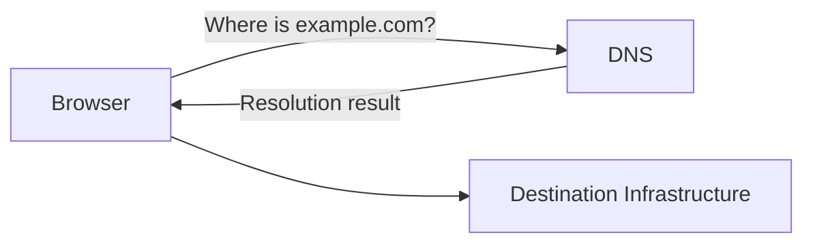
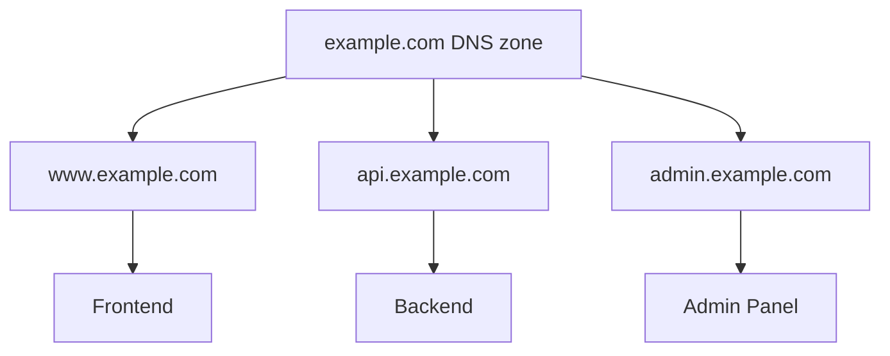

# 03 — 🌐 Domains, DNS & DNS Records

> [!IMPORTANT]
> ## 🔵 Core Idea
> DNS converts human-friendly names into information that lets clients locate the destination infrastructure.

## ⚡ Pareto — Remember This

```text
Domain = Name
DNS    = Name resolution system
A      = Hostname → IPv4
AAAA   = Hostname → IPv6
CNAME  = Hostname → another hostname
```

---

## 1. Why DNS Exists

Humans prefer:

```text
amazon.in
google.com
github.com
```

instead of memorizing raw IP addresses.

Mental analogy:

```text
Contact name → Phone number
Domain       → DNS resolution → destination
```

---

## 2. Basic DNS Flow



At Pareto level:

> **DNS helps map/resolve a domain or hostname toward the destination.**

We intentionally postpone deeper internals such as recursive resolvers, root servers, TLDs and authoritative servers.

---

## 3. Domain ≠ Server

Suppose you own:

```text
himanshu.dev
```

That domain is **not the application itself**.

```text
Domain
  ↓
DNS
  ↓
Server / Load Balancer / CDN / Hosting Platform
```

> [!WARNING]
> ## 🔴 Don't Confuse
> **Domain ≠ DNS ≠ Server**
>
> - Domain → human-friendly name
> - DNS → resolves the name
> - Server/infrastructure → runs or routes the workload

---

## 4. DNS Records — Pareto Set

### A Record

```text
app.example.com
       ↓ A
203.0.113.x
```

Meaning:

> Hostname → IPv4 address.

### AAAA Record

```text
app.example.com
       ↓ AAAA
2001:db8:....
```

Meaning:

> Hostname → IPv6 address.

### CNAME

```text
www.example.com
       ↓ CNAME
example.hosting-provider.com
```

Meaning:

> One hostname aliases another hostname.

---

## 5. `www` Is Not Magical

You can have:

```text
www.example.com
api.example.com
admin.example.com
docs.example.com
status.example.com
```

Possible architecture:



---

## 6. Domain vs URL

Example:

```text
https://shop.example.com/products?id=123
```

Breakdown:

| Part | Value |
|---|---|
| Protocol | `https://` |
| Host | `shop.example.com` |
| Path | `/products` |
| Query | `?id=123` |

> [!TIP]
> Ye distinction DNS, Nginx routing, APIs, CDNs, load balancers and Kubernetes ingress sab mein useful hogi.

---

## 7. Deeper DNS Topics — Later

Not required yet:

- Recursive resolver
- Root servers
- TLD servers
- Authoritative DNS
- TTL
- DNS caching
- MX
- TXT
- NS
- DNSSEC

> [!TIP]
> Pareto rule: pehle DNS ka role samjho. Internals tab jab cloud/networking chunk mein need aaye.

---

## 🔑 Keywords

`Domain` `Hostname` `DNS` `DNS Record` `A Record` `AAAA Record` `CNAME` `URL` `Path` `Query`

---

## 🧠 Active Recall — Short Answers

**Q1. DNS ka core job?**  
Human-friendly domain/hostname ko destination information mein resolve karna.

**Q2. Domain aur server same hain?**  
No.

**Q3. A record?**  
Hostname → IPv4 address.

**Q4. AAAA record?**  
Hostname → IPv6 address.

**Q5. CNAME?**  
Hostname → another hostname.

**Q6. `api.example.com` mein `api` kya hai?**  
Hostname/subdomain label that may point to separate infrastructure.

**Q7. Domain aur complete URL same hain?**  
No. URL also includes protocol, path, query and potentially other components.
