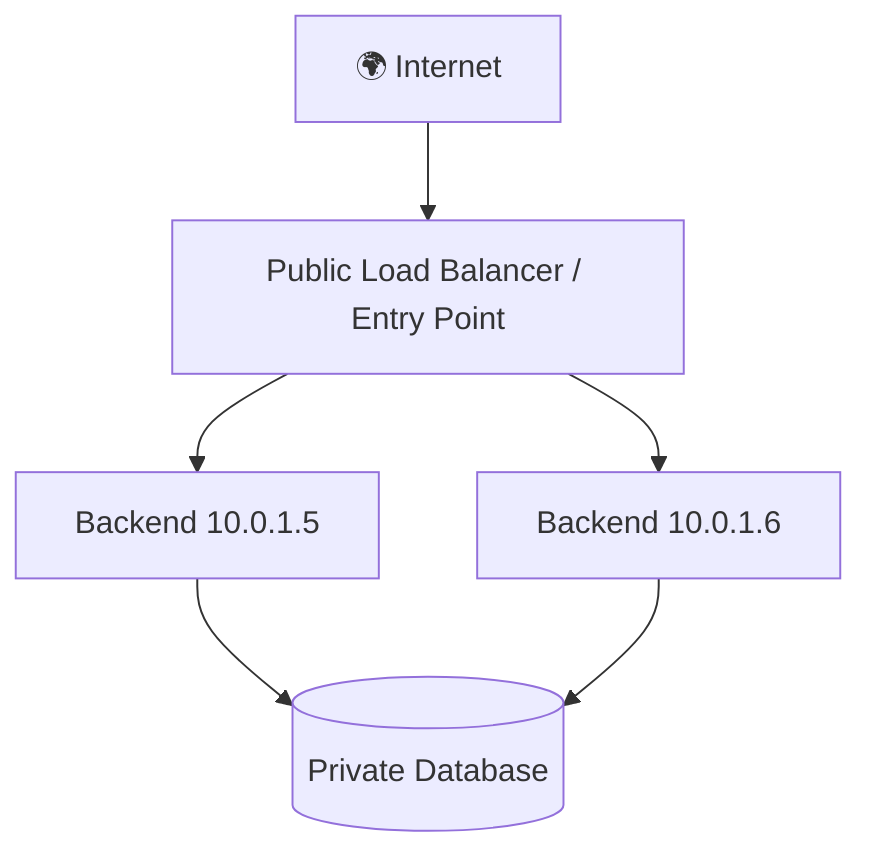

# 04 — 🛜 Public/Private IP, Router, NAT & Firewall

> [!IMPORTANT]
> ## 🔵 Core Idea
> Real production systems separate public entry points from private/internal services and tightly control what network traffic is allowed.

## ⚡ Pareto — Remember This

```text
Public IP  → internet-routable addressing
Private IP → internal/private network addressing
Router     → forwards packets between networks
NAT        → translates/maps network addresses/connections
Firewall   → allow/block traffic using rules
```

---

## 1. Public vs Private IP

Home/hostel style network:

```text
                    INTERNET
                        │
                    Public IP
                        │
                   ┌────▼────┐
                   │ Router  │
                   └────┬────┘
                        │
                 PRIVATE NETWORK
             ┌──────────┼──────────┐
             ▼          ▼          ▼
          Laptop      Phone       TV
       192.168.x.x 192.168.x.x 192.168.x.x
```

### Common Private IPv4 Ranges

```text
10.0.0.0/8
172.16.0.0 – 172.31.255.255
192.168.0.0/16
```

Recognition is enough for now.

---

## 2. NAT

NAT = **Network Address Translation**

Simplified example:

```text
Laptop private IP
192.168.1.5
       ↓
     Router
       ↓ NAT
Public Internet-facing address
       ↓
    Internet
```

Router/NAT maintains translation/state so return traffic reaches the correct internal connection/device.

> [!TIP]
> Private addressing + NAT became a major way to let many devices share fewer public IPv4 addresses.

---

## 3. Router

Simplified job:

> Packets ko networks ke beech appropriate next destination ki taraf forward karna.

```text
Laptop
  ↓
Router
  ↓
ISP
  ↓
Internet routers
  ↓
Destination network
  ↓
Server
```

Useful command on Windows:

```powershell
tracert google.com
```

On Linux:

```bash
traceroute google.com
```

This helps visualize network hops.

---

## 4. Firewall

Suppose server has services:

```text
22     SSH
80     HTTP
443    HTTPS
3000   Node
27017  MongoDB
6379   Redis
```

Should entire internet access everything?

**No.**

Example rule philosophy:

```text
Internet
   │
   ├── :80    ✓
   ├── :443   ✓
   ├── :22    restricted
   ├── :3000  ✗ direct public access not needed
   ├── :27017 ✗
   └── :6379  ✗
```

> [!CAUTION]
> ## 🔴 Security Rule
> **Expose only what actually needs to be exposed.**

---

## 5. Cloud Architecture Connection

Cloud systems often look like:



Backend and database can remain inside private networks while public traffic enters through controlled infrastructure.

This becomes highly relevant in:

- AWS VPC
- Subnets
- Security Groups
- Load Balancers
- NAT Gateways
- Kubernetes networking

---

## 6. Useful Commands

### Check route path

```powershell
tracert google.com
```

### Inspect network configuration

Windows:

```powershell
ipconfig
```

Linux:

```bash
ip addr
```

### Test reachability

```bash
ping example.com
```

> [!WARNING]
> Ping failure does not always mean a service is down. ICMP may be blocked.

---

## 🔑 Keywords

`Public IP` `Private IP` `Router` `NAT` `Firewall` `Subnet` `Network Hop` `Internet-routable`

---

## 🧠 Active Recall — Short Answers

**Q1. Private IP kya hai?**  
Private/internal network ke andar use hone wala non-publicly-routable address.

**Q2. Public IP?**  
Internet-routable addressing.

**Q3. Router kya karta hai?**  
Packets ko networks ke beech route/forward karta hai.

**Q4. NAT?**  
Network addresses/connections ko translate/map karta hai.

**Q5. Firewall?**  
Rules ke basis par network traffic allow/block karta hai.

**Q6. Database ko generally directly public internet par expose karna chahiye?**  
No.

**Q7. `192.168.x.x` commonly kis type ka address hota hai?**  
Private IPv4 address.
