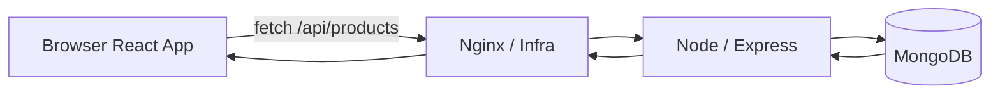
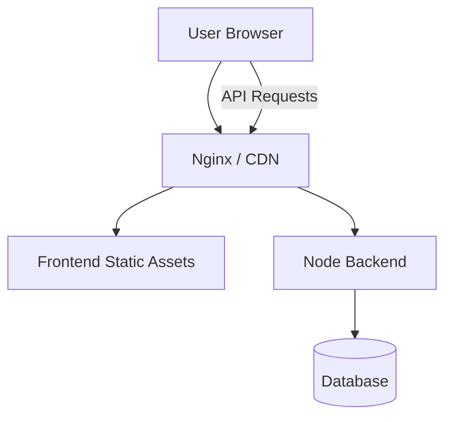

# 05 — 🧩 Frontend & Backend — Infrastructure POV

> [!IMPORTANT]
> ## 🔵 Core Idea
> DevOps perspective se sirf "frontend/backend/database" jaana enough nahi hai. Important question hai: **ye components actually run kahan ho rahe hain?**

## ⚡ Pareto — Remember This

```text
Client-side React → browser executes it
Backend Node      → server infrastructure executes it
Database          → data service / DB infrastructure
Next.js           → may involve both server-side and client-side execution
```

---

## 1. Development Environment

Local machine par:

```text
YOUR LAPTOP

React     → localhost:5173
Express   → localhost:3000
MongoDB   → localhost:27017
```

Everything ek hi machine par ho sakta hai.

---

## 2. Production Frontend — React/Vite SPA

Development:

```bash
npm run dev
```

Production:

```bash
npm run build
```

Typical output:

```text
dist/
├── index.html
└── assets/
    ├── app.js
    └── app.css
```

These are static browser-consumable assets.

Architecture:

```text
Browser
   │
   ▼
Nginx / CDN
   │
   ├── index.html
   ├── app.js
   └── app.css
```

Browser downloads the JavaScript, and the client-side React application runs primarily in the browser.

> [!IMPORTANT]
> React SPA ka production code continuously web server par UI execute nahi karta.  
> Browser JavaScript execute karta hai.

---

## 3. Backend

Backend server-side infrastructure par run karta hai.



Backend handles:

- Business logic
- Authentication/authorization
- Database access
- API responses
- Server-only secrets

---

## 4. Next.js Caveat

Next.js can execute code in multiple places.

```text
NEXT.JS APP
│
├── Server-side
│   ├── Server Components
│   ├── Route Handlers
│   └── SSR
│
└── Client-side
    ├── Client Components
    └── Browser interactivity
```

> [!WARNING]
> ## 🔴 Don't Confuse
> **React SPA deployment ≠ always Next.js deployment.**

Different rendering/application models can create different infrastructure requirements.

---

## 5. Deployment Architecture



Components do not need to live on the same machine.

For example:

```text
Frontend → CDN
Backend  → Cloud VM / containers
Database → Managed DB service
```

---

## 6. Infrastructure Questions

For every application component ask:

```text
Where does it run?
Who can access it?
Which port?
How is it deployed?
How is it updated?
How is it secured?
How is it monitored?
What happens if it crashes?
```

This is DevOps thinking.

---

## 🔑 Keywords

`Frontend` `Backend` `Static Assets` `Build` `Browser Runtime` `Server Runtime` `CSR` `SSR` `SSG` `API`

---

## 🧠 Active Recall — Short Answers

**Q1. React SPA production build generally kya produce karta hai?**  
Static HTML/CSS/JS assets.

**Q2. Client-side React mainly kahan execute hota hai?**  
User's browser.

**Q3. Node backend kahan execute hota hai?**  
Server-side infrastructure.

**Q4. Frontend aur backend same machine par hona compulsory hai?**  
No.

**Q5. Next.js sirf browser mein run karta hai?**  
No. It can include both server-side and client-side execution.

**Q6. DevOps perspective ka key question?**  
Component actually run/deploy kahan ho raha hai and how traffic reaches it.
