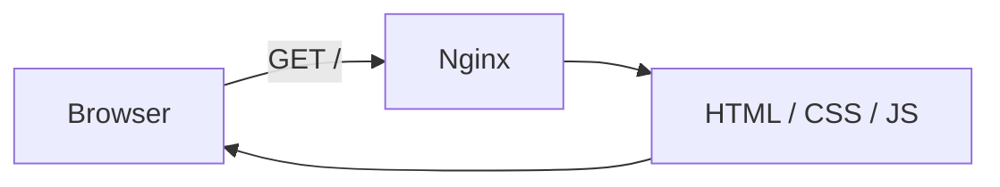
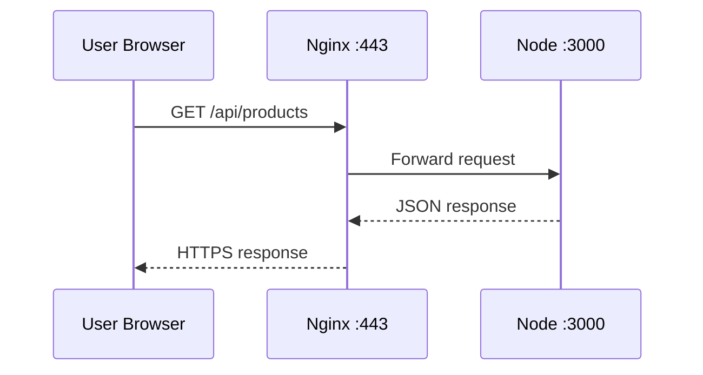
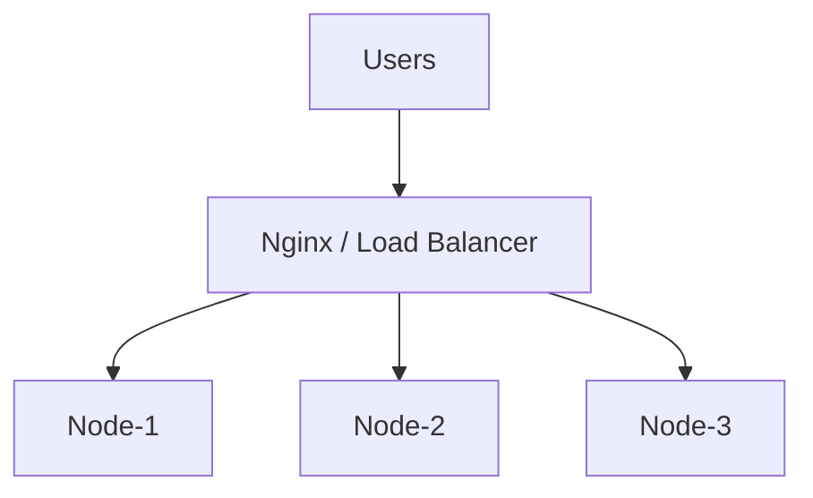

# 06 — ⚙️ Nginx & Reverse Proxy

> [!IMPORTANT]
> ## 🔵 Core Idea
> Nginx can act as the public-facing web layer that serves static files, terminates TLS, proxies requests to backends and can distribute traffic.

## ⚡ Pareto — Nginx ke 4 Roles

```text
1. Static file server
2. Reverse proxy
3. TLS termination
4. Load balancing
```

---

## 1. Static Web Server

Suppose website:

```text
index.html
style.css
script.js
```

Nginx can serve them directly:



This is the role Nginx often plays in a simple static Docker webpage.

---

## 2. Why Not Expose Node Directly?

Suppose:

```text
Node → localhost:3000
```

You do not necessarily need:

```text
Internet → myapp.com:3000
```

Instead:

```text
Internet
   │ HTTPS :443
   ▼
Nginx
   │ internal proxy
   ▼
Node :3000
```

Benefits include:

- Clean public entry point
- TLS handling
- Static asset serving
- Backend hiding/routing
- Load balancing
- Centralized request controls

---

## 3. Reverse Proxy

User requests:

```text
https://myapp.com/api/products
```

Node actually listens at:

```text
localhost:3000
```

Flow:



User doesn't need to know backend's internal address/port.

> [!IMPORTANT]
> Reverse proxy acts on behalf of the **server-side infrastructure**.

---

## 4. Forward Proxy vs Reverse Proxy

### Forward Proxy

```text
Client → Forward Proxy → Internet → Website
```

Represents/intermediates the client side.

### Reverse Proxy

```text
Internet → Reverse Proxy → Backend(s)
```

Represents/intermediates the server side.

> [!WARNING]
> ## 🔴 Don't Confuse
> **Forward proxy → client side**  
> **Reverse proxy → server side**

---

## 5. Routing Multiple Paths

Example:

```text
myapp.com/       → frontend
myapp.com/api/   → backend
```

Conceptual Nginx config:

```nginx
location / {
    root /var/www/frontend;
}

location /api/ {
    proxy_pass http://localhost:3000;
}
```

Do not memorize syntax yet. Architecture matters more.

---

## 6. Load Balancing Idea

When one backend isn't enough:



Now incoming requests can be distributed across multiple backend instances.

This is our first natural step toward horizontal scaling.

---

## 7. Firewall + Nginx Together

Public:

```text
80   ✓
443  ✓
```

Internal/private:

```text
3000   Node
27017  MongoDB
6379   Redis
```

So:

```text
Internet → Nginx :443 → Node :3000 → MongoDB :27017
```

> [!CAUTION]
> Internal ports should not be exposed publicly unless there is a specific justified requirement.

---

## 🔑 Keywords

`Nginx` `Web Server` `Static Files` `Reverse Proxy` `Forward Proxy` `Upstream` `Proxy Pass` `Load Balancer` `TLS Termination`

---

## 🧠 Active Recall — Short Answers

**Q1. Nginx ke Pareto four roles?**  
Static serving, reverse proxy, TLS termination, load balancing.

**Q2. Reverse proxy kya karta hai?**  
Client requests receive karke appropriate backend ko forward karta hai.

**Q3. Node port `3000` public expose karna compulsory hai?**  
No.

**Q4. Forward proxy kis side ko represent karta hai?**  
Client side.

**Q5. Reverse proxy kis side ko represent karta hai?**  
Server side.

**Q6. Static Docker webpage mein Nginx ka main role kya ho sakta hai?**  
Static web server.

**Q7. `Nginx → Node:3000` mein Nginx ka role?**  
Reverse proxy.

**Q8. Multiple Node instances ke saath Nginx aur kya kar sakta hai?**  
Load balancing.
