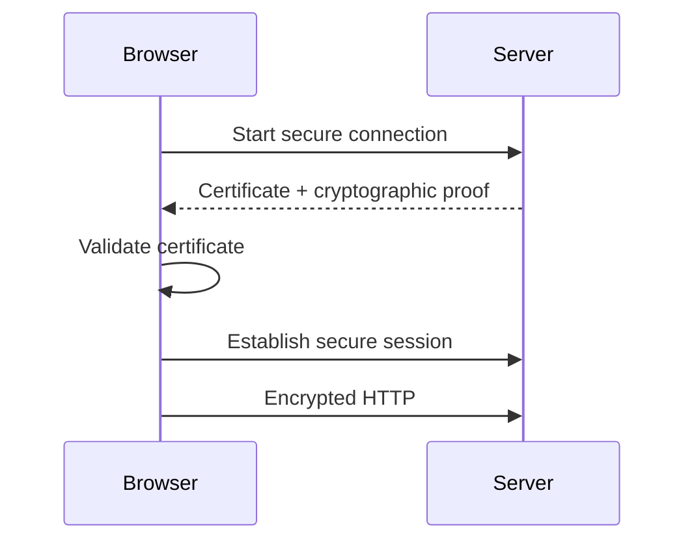

# 07 — 🔒 TLS, HTTPS & Certificates

> [!IMPORTANT]
> ## 🔵 Core Idea
> TLS allows clients and servers to establish authenticated, encrypted communication with integrity protection.

## ⚡ Pareto — Remember This

```text
HTTPS = HTTP protected by TLS

TLS gives us:
1. Confidentiality
2. Integrity
3. Authentication
```

---

## 1. Why TLS?

Without transport encryption, someone capable of intercepting the network path could potentially observe or modify traffic.

We want:

```text
CONFIDENTIALITY
      +
INTEGRITY
      +
AUTHENTICATION
```

---

## 2. Encryption Mental Model

Without TLS:

```text
Client → readable application data → Network → Server
```

With TLS:

```text
Client
  ↓ encrypt
Ciphertext over network
  ↓ decrypt
Server
```

The goal is that passive observers cannot simply read plaintext application data.

---

## 3. Authentication Problem

Encryption alone isn't enough.

Browser must also answer:

> "Am I really talking to `example.com`?"

Server presents a **digital certificate** and cryptographic proof during TLS setup.

Simplified:



---

## 4. Certificate Authority — CA

CA = **Certificate Authority**

Browser/OS maintains trust stores containing trusted certificate authorities.

Certificates help bind:

```text
Domain identity
      ↕
Cryptographic key material
```

Examples of CAs include Let's Encrypt and commercial providers.

---

## 5. Browser Validation — Simplified

Browser checks concepts such as:

```text
Does certificate match the hostname?
Is it valid for the current time?
Is the trust chain acceptable?
Has setup completed correctly?
```

If validation fails, browser can show a security warning.

---

## 6. TLS Termination

A common architecture:


Nginx handles the internet-facing TLS connection.

This is called:

> **TLS termination**

The backend does not necessarily need to individually handle the external TLS handshake itself.

---

## 7. SSL vs TLS

You'll hear both terms.

> [!WARNING]
> ## 🔴 Don't Confuse
> Modern HTTPS uses **TLS**.  
> People still commonly say "SSL certificate", but SSL itself is obsolete.

---

## 8. What TLS Does NOT Automatically Solve

TLS does not magically make an application fully secure.

It does **not** replace:

- Authentication
- Authorization
- Secure coding
- Input validation
- Firewalling
- Secrets management
- Patch management

> [!CAUTION]
> HTTPS protects communication in transit; it is not a complete security architecture.

---

## 🔑 Keywords

`TLS` `HTTPS` `Encryption` `Confidentiality` `Integrity` `Authentication` `Certificate` `CA` `Trust Chain` `TLS Handshake` `TLS Termination`

---

## 🧠 Active Recall — Short Answers

**Q1. HTTPS kis protocol se protect hota hai?**  
TLS.

**Q2. TLS ke three core security goals?**  
Confidentiality, integrity and authentication.

**Q3. Certificate ka basic role?**  
Server identity/authentication establish karne mein help karna.

**Q4. CA ka full form?**  
Certificate Authority.

**Q5. TLS termination kya hai?**  
Front-facing component incoming TLS handle karta hai and traffic backend ko forward karta hai.

**Q6. HTTPS hone ka matlab application fully secure hai?**  
No.

**Q7. SSL aur TLS mein modern protocol kaunsa hai?**  
TLS.
