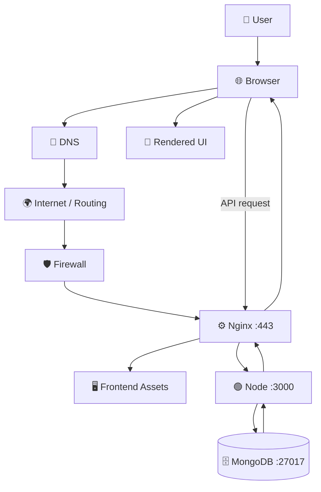

# 08 — 🔁 End-to-End Website Request Lifecycle

> [!IMPORTANT]
> ## 🎯 Goal
> Browser mein `https://shop.com/products` type karne se lekar UI render hone tak ka complete flow.

## ⚡ Master Architecture



---

# Walkthrough

## Step 1 — Browser Parses URL

User enters:

```text
https://shop.com/products
```

Breakdown:

```text
Protocol → HTTPS
Host     → shop.com
Path     → /products
```

---

## Step 2 — DNS Resolution

Browser/system needs to find destination information for:

```text
shop.com
```

Conceptually:

```text
shop.com
   ↓
DNS
   ↓
IP / destination infrastructure
```

---

## Step 3 — Network Routing

Traffic moves through networking infrastructure:

```text
Laptop
  ↓
Wi‑Fi / Router
  ↓
ISP
  ↓
Internet routers
  ↓
Destination network
```

---

## Step 4 — Transport Connection

For typical HTTP/1.1 or HTTP/2 over TCP:

```text
TCP connection
      ↓
TLS handshake
```

For HTTP/3:

```text
QUIC over UDP
```

Pareto focus remains HTTP/HTTPS + TCP mental model for now.

---

## Step 5 — TLS Certificate Validation

Server presents certificate.

Browser validates concepts such as:

```text
Hostname match?
Trusted certificate chain?
Validity period?
Cryptographic proof?
```

---

## Step 6 — Secure Session Established

TLS session keys are established.

Now HTTP traffic can travel securely.

---

## Step 7 — Browser Sends HTTP Request

Conceptually:

```http
GET /products
Host: shop.com
```

---

## Step 8 — Firewall Allows Public Traffic

Internet-facing rules may allow:

```text
443 ✓
80  ✓ or redirected
```

while internal ports remain unavailable publicly.

---

## Step 9 — Nginx Receives Request

Nginx can:

- Handle TLS
- Serve static assets
- Route `/api/*`
- Proxy backend requests
- Load balance later

---

## Step 10 — Frontend Loads

For a React SPA, browser receives:

```text
index.html
app.js
app.css
```

Then browser executes React.

---

## Step 11 — Frontend Calls API

Example:

```js
fetch("/api/products");
```

Flow:

```text
Browser
   ↓ HTTPS
Nginx
   ↓ proxy
Node :3000
```

---

## Step 12 — Backend Executes Logic

Example route:

```js
app.get("/api/products", async (req, res) => {
  // fetch products
});
```

Backend may:

- Validate request
- Authenticate user
- Apply business logic
- Query database

---

## Step 13 — Database Query

```text
Node
 ↓
MongoDB
 ↓
Products
```

---

## Step 14 — Response Travels Back

```text
MongoDB
   ↓
Node
   ↓
Nginx
   ↓
HTTPS
   ↓
Browser
```

Example JSON:

```json
[
  {
    "name": "Laptop",
    "price": 60000
  }
]
```

---

## Step 15 — UI Renders

```text
JSON
 ↓
React state
 ↓
DOM/UI
 ↓

┌────────────────────┐
│ Laptop             │
│ ₹60,000            │
│ [Add to Cart]      │
└────────────────────┘
```

---

## 🧠 One-Line Master Story

> **Domain resolves through DNS → network reaches public infrastructure → TLS secures communication → Nginx routes traffic → frontend runs in browser → backend executes logic → database returns data → response returns to UI.**

---

## 🔑 Keywords

`URL Parsing` `DNS Resolution` `Routing` `TCP Connection` `TLS Handshake` `Certificate Validation` `HTTP Request` `Reverse Proxy` `API` `Database Query` `HTTP Response` `Rendering`

---

## 🧠 Active Recall — Short Answers

**Q1. Browser pehle URL se kya identify karta hai?**  
Protocol, host and path.

**Q2. Domain se destination kaun resolve karta hai?**  
DNS.

**Q3. HTTPS ke secure session se pehle kya hota hai?**  
TLS handshake/certificate validation.

**Q4. Public request ko frontend/backend tak kaun route kar sakta hai?**  
Nginx/reverse proxy or equivalent infrastructure.

**Q5. React SPA API data ka typical flow?**  
Browser → Nginx → backend → DB → backend → browser.

**Q6. Database direct browser ko response bhejta hai?**  
Usually no; backend mediates application access.

**Q7. Final UI rendering client-side React case mein kahan hoti hai?**  
Browser.
