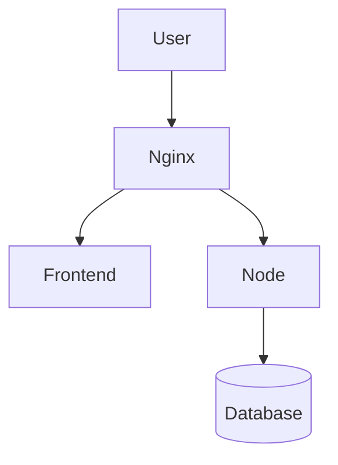
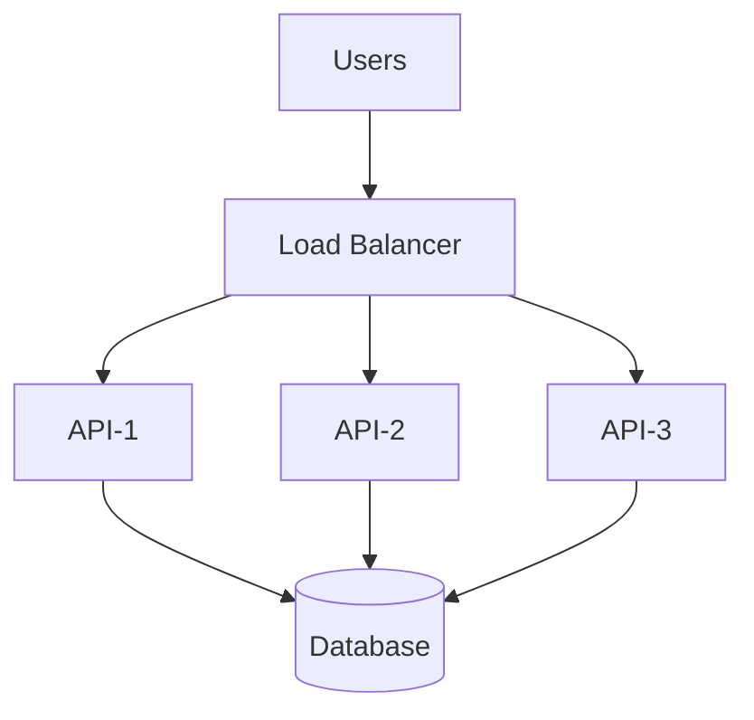
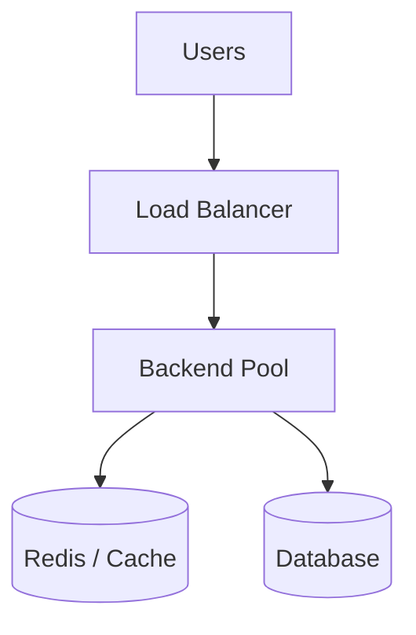
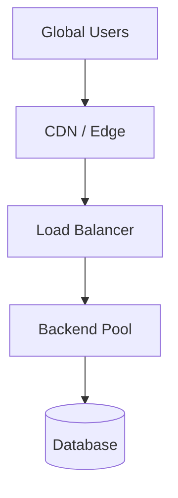
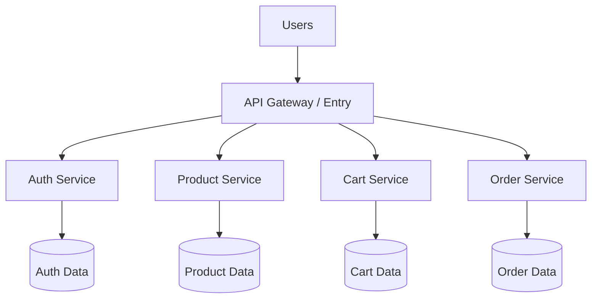
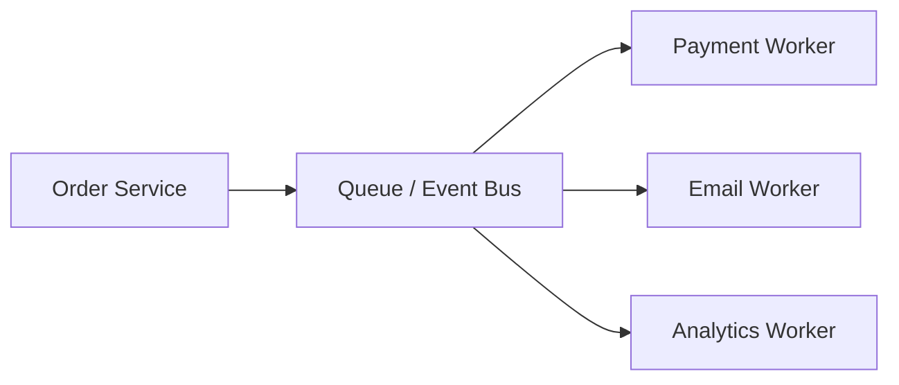
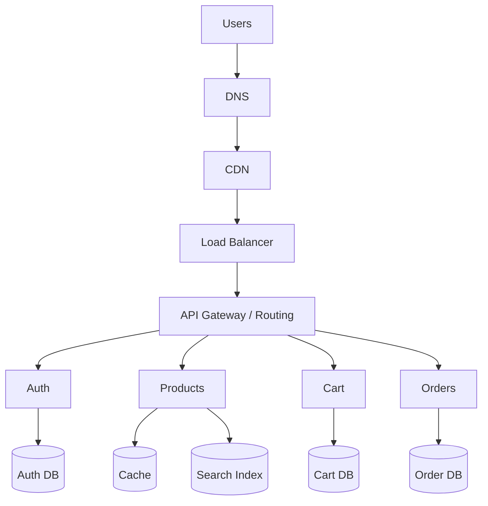
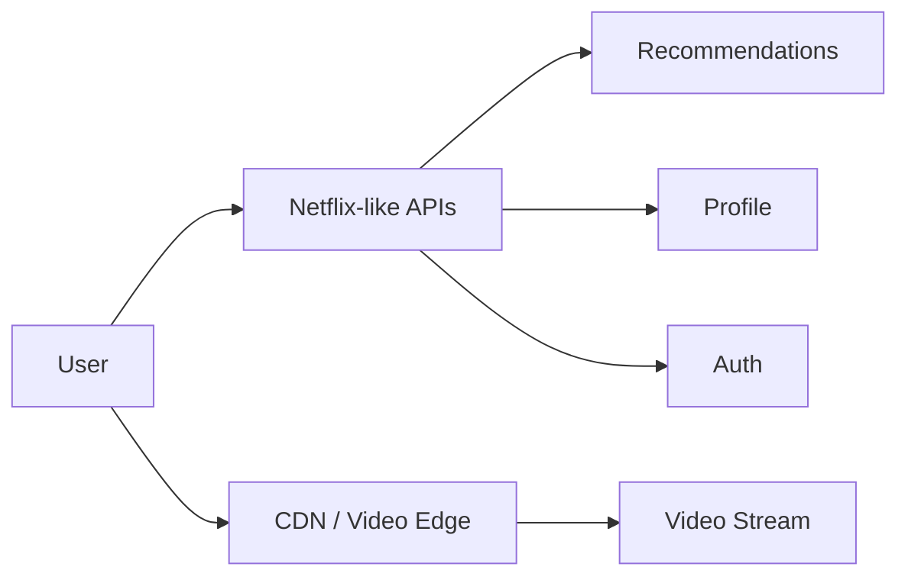

# 09 — 🏗️ Architecture Evolution

> [!IMPORTANT]
> ## 🔵 Core Idea
> Large systems ko giant diagram ki tarah memorize mat karo.  
> **Har new box ek problem solve karta hai.**

---

## Version 0 — One Machine

```text
User
 ↓
Server
```

Good for:

- Small demo
- Learning
- Tiny workloads

Problem:

- No separation
- Single point of failure
- Hard to scale

---

## Version 1 — Full-Stack App

```text
User
 ↓
Node
 ↓
Database
```

Now application logic and persistent data exist.

Problem:

- Public backend exposure
- TLS/static routing concerns
- Single backend instance

---

## Version 2 — Nginx Front Door



Nginx adds:

- Static serving
- Reverse proxy
- TLS termination
- Central public entry

---

## Version 3 — Multiple Backend Instances



Problem solved:

> One backend is not enough.

Concept introduced:

> **Horizontal scaling**

---

## Version 4 — Cache



Why cache?

- Repeated expensive reads
- Reduce DB pressure
- Faster responses for hot data

---

## Version 5 — CDN



Why CDN?

- Users geographically distributed
- Static/media content closer to users
- Reduce origin load

---

## Version 6 — Service-Oriented / Microservice Shape



Why split?

Possible reasons include:

- Independent scaling
- Team ownership
- Different data models
- Deployment isolation
- Domain boundaries

> [!WARNING]
> Microservices are not automatically better. They add operational complexity.

---

## Version 7 — Event-Driven Work



Why queue/events?

- Work need not happen synchronously
- Decouple services
- Buffer bursts
- Retry background work

---

## Amazon-ish Mental Model



Not actual Amazon internals—this is a **learning model**.

---

## Netflix-ish Difference

Streaming systems care heavily about:

```text
Video storage
Encoding
CDN / edge delivery
Playback
Recommendations
Profiles
Subscriptions
Analytics
```

A simplified split:



Key insight:

> API data and massive media delivery may take very different paths.

---

## 🧠 Architecture Reasoning Table

| New Box | Problem It Solves |
|---|---|
| DNS | Human-friendly discovery |
| Nginx / Reverse Proxy | Front door, routing, TLS, static serving |
| Load Balancer | Multiple backend instances |
| Cache / Redis | Repeated expensive access |
| CDN | Geographic content delivery |
| Queue | Async/background work |
| Multiple services | Independent domains/scaling/ownership |
| Monitoring | Understand system health |
| Kubernetes | Manage containerized workloads at scale |
| Terraform | Reproducible infrastructure as code |

---

## 🧠 Active Recall — Short Answers

**Q1. Large architecture kaise learn karni chahiye?**  
Har new component ko us problem se connect karke jo woh solve karta hai.

**Q2. Load balancer kyun?**  
Traffic multiple backend instances mein distribute karne ke liye.

**Q3. Cache kyun?**  
Repeated expensive access ko faster aur cheaper banane ke liye.

**Q4. CDN kyun?**  
Content ko geographically users ke closer serve karne ke liye.

**Q5. Queue kyun?**  
Async/background work ko decouple and buffer karne ke liye.

**Q6. Microservices always better?**  
No. They add significant operational complexity.
