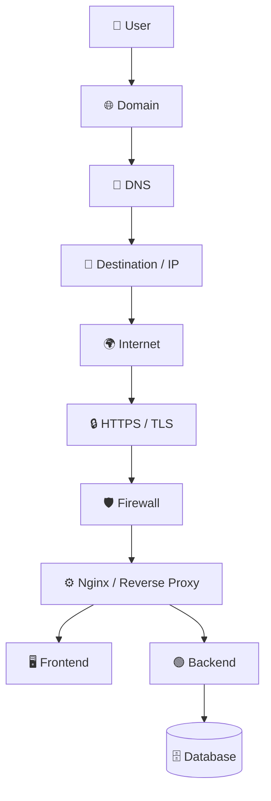

# 🌐 Unit 01 — How Websites Actually Work

> [!IMPORTANT]
> ## 🎯 Core Goal
> Understand what happens from the moment a user types a domain such as `amazon.in` until the application returns a usable page.

## ⚡ Pareto — The Master Flow



> [!TIP]
> If this flow becomes intuitive, Docker, AWS, load balancers, Kubernetes networking and cloud architecture become much easier.

---

## 📚 Chapter Map

| # | Topic | Main Question |
|---|---|---|
| 01 | [Internet, Web, Server, IP & Ports](01-Internet-Web-Server-IP-Ports.md) | Website tak request jaati kahan hai? |
| 02 | [HTTP, HTTPS, TCP & UDP](02-HTTP-HTTPS-TCP-UDP.md) | Data communicate aur travel kaise karta hai? |
| 03 | [Domains, DNS & DNS Records](03-Domains-DNS-Records.md) | `amazon.in` destination mein kaise resolve hota hai? |
| 04 | [Public/Private IP, Router, NAT & Firewall](04-Networking-NAT-Firewall.md) | Local/private network internet se kaise connect hota hai? |
| 05 | [Frontend & Backend — Infrastructure POV](05-Frontend-Backend-Infrastructure.md) | React/Node production mein actually run kahan karte hain? |
| 06 | [Nginx & Reverse Proxy](06-Nginx-Reverse-Proxy.md) | Node ko directly internet par expose kyun nahi karte? |
| 07 | [TLS & Certificates](07-TLS-Certificates.md) | HTTPS trust + encryption kaise establish karta hai? |
| 08 | [End-to-End Request Lifecycle](08-End-to-End-Request-Lifecycle.md) | Browser se DB aur wapas complete flow kya hai? |
| 09 | [Architecture Evolution](09-Architecture-Evolution.md) | Scale badhne par new boxes kyun appear hote hain? |
| 10 | [Keywords Cheat Sheet](10-Keywords-Cheat-Sheet.md) | Fast vocabulary revision |
| 11 | [Active Recall](11-Active-Recall.md) | Interview + revision test |
| 12 | [2-Minute Revision](12-Two-Minute-Revision.md) | Ultra-fast recall |

---

## 🧠 The Engineering Mindset

A developer may think:

```text
React → Node → MongoDB
```

A DevOps / infrastructure engineer starts asking:

- Ye application **run kahan** kar rahi hai?
- Domain request **kis machine/infrastructure** tak ja rahi hai?
- Kaunse **ports exposed** hain?
- HTTPS certificate **kaun handle** kar raha hai?
- Node crash hua toh?
- Machine crash hui toh?
- Traffic ×100 hua toh?
- Logs kahan hain?
- Deployment rollback kaise hoga?
- Database publicly accessible kyun nahi hona chahiye?

> [!IMPORTANT]
> DevOps ka core kaam tools yaad karna nahi hai.  
> **Application ko reliable, secure, scalable aur deployable banana hai.**

---

## 🔑 Unit 01 Core Keywords

`Internet` `Web` `Server` `Client` `IP Address` `Port` `localhost`  
`HTTP` `HTTPS` `TCP` `UDP` `DNS` `Domain` `A Record` `AAAA` `CNAME`  
`Public IP` `Private IP` `Router` `NAT` `Firewall`  
`Frontend` `Backend` `Database` `Nginx` `Web Server` `Reverse Proxy`  
`TLS` `Certificate` `CA` `TLS Termination` `Load Balancer`

---

## ✅ Unit Completion Checklist

- [x] Website request ka basic lifecycle
- [x] Internet vs Web
- [x] Server, IP, ports
- [x] HTTP/HTTPS
- [x] TCP/UDP
- [x] DNS basics
- [x] Public/private networking
- [x] NAT/firewall
- [x] Frontend/backend deployment view
- [x] Nginx/reverse proxy
- [x] TLS/certificates
- [x] Architecture evolution
- [x] Active Recall
