# 🌐 DevOps From First Principles — Unit 01 Complete Notes
> Consolidated single-file version. The split chapter files are better for Obsidian/GitHub navigation.


---

# 01 — 🌍 Internet, Web, Server, IP & Ports

> [!IMPORTANT]
> ## 🔵 Core Idea
> A website is fundamentally a client sending network requests to infrastructure that runs software and returns responses.

## ⚡ Pareto — Remember This

```text
Internet = network of networks
Web      = HTTP/HTTPS-based service on top of the internet
Server   = computer/software serving requests
IP       = where the destination is
Port     = which service on that machine
```

---

## 1. Internet ≠ Web

### Internet

Internet ko simple mental model mein samjho:

> **Networks ka giant network.**

```text
Laptop ─┐
Phone ──┤
Server ─┼──── INTERNET
Router ─┤
Cloud ──┘
```

### Web

Web internet ke upar chalne wali ek service hai.

```text
Internet
│
├── Web → HTTP / HTTPS
├── Email
├── SSH
├── DNS
└── many other protocols
```

> [!WARNING]
> ## 🔴 Don't Confuse
> **Internet ≠ Web**  
> Internet underlying network infrastructure hai.  
> Web us infrastructure par chalne wali HTTP/HTTPS-based service hai.

---

## 2. Client & Server

### Client

Client request initiate karta hai.

Examples:

- Browser
- Mobile app
- CLI tool like `curl`
- Another backend service

### Server

Server fundamentally koi magical cloud object nahi hai.

```text
┌────────────────────────────┐
│          COMPUTER          │
│                            │
│ CPU                        │
│ RAM                        │
│ SSD                        │
│ Network Interface          │
│ Operating System           │
│                            │
│ Running application        │
└────────────────────────────┘
```

> [!TIP]
> Tumhara laptop bhi server ban sakta hai if it runs software that listens for network requests.

Example:

```js
app.listen(3000);
```

This means the Node application is listening on **port 3000**.

---

## 3. IP Address

IP address ka basic job:

> Network ko destination identify/address karne mein help karna.

Mental analogy:

```text
House address → IP address
Room number   → Port
```

Example:

```text
192.168.1.10:3000
│             │
│             └── Service / port
└──────────────── Machine/network address
```

---

## 4. Ports

Ek machine par multiple services run kar sakti hain:

```text
               SERVER
            IP: 10.0.0.5

     ┌─────────────────────┐
:22  │ SSH                 │
:80  │ HTTP                │
:443 │ HTTPS               │
:3000│ Node App            │
:6379│ Redis               │
     └─────────────────────┘
```

> [!IMPORTANT]
> **IP tells you the machine/network destination.**  
> **Port helps identify the network service endpoint on that machine.**

### Common Ports — Pareto Set

| Port | Typical Service |
|---:|---|
| `22` | SSH |
| `80` | HTTP |
| `443` | HTTPS |
| `3000` | Common local Node dev/app port |
| `6379` | Redis default |
| `27017` | MongoDB default |

> [!CAUTION]
> Port numbers do not magically define a service. They are conventions/defaults. Applications can often be configured to listen elsewhere.

---

## 5. `localhost`

When you use:

```text
http://localhost:3000
```

Break it down:

```text
http:// localhost : 3000
  │        │          │
  │        │          └── Port
  │        └───────────── This computer
  └────────────────────── Protocol
```

Meaning:

> Apni machine par port `3000` par listening service se HTTP ke through communicate karo.

### Loopback

`localhost` generally resolves to loopback addresses such as:

```text
127.0.0.1   → IPv4 loopback
::1         → IPv6 loopback
```

Pareto level par bas yaad rakho:

> `localhost` = **this machine itself**

---

## 6. DevOps Connection

Developer:

```text
Node application ready ✅
```

Infrastructure questions:

```text
Where does it run?
Which IP?
Which port?
Can internet reach it?
Should internet reach it?
Who handles HTTPS?
What happens if it crashes?
```

Yehi questions aage Nginx, firewall, cloud, Docker, load balancer aur Kubernetes tak le jaate hain.

---

## 🔑 Keywords

`Internet` — network of networks  
`Web` — HTTP/HTTPS-based web ecosystem  
`Client` — initiates a request  
`Server` — serves requests/services  
`IP Address` — network addressing/destination  
`Port` — service endpoint identifier  
`localhost` — local machine / loopback

---

## 🧠 Active Recall — Short Answers

**Q1. Internet aur Web same hain?**  
No. Internet underlying network hai; Web uske upar chalne wali service hai.

**Q2. Server fundamentally kya hai?**  
A computer/software system that listens for and serves requests.

**Q3. IP address ka role?**  
Network destination ko address/locate karna.

**Q4. Port kyun chahiye?**  
Same machine par correct network service endpoint identify karne ke liye.

**Q5. `localhost:3000` ka matlab?**  
Apni machine par port 3000 wali service.

**Q6. HTTP ka common port?**  
80.

**Q7. HTTPS ka common port?**  
443.


---

# 02 — 📡 HTTP, HTTPS, TCP & UDP

> [!IMPORTANT]
> ## 🔵 Core Idea
> HTTP defines web request/response semantics, while transport protocols such as TCP or QUIC move data across the network.

## ⚡ Pareto — Remember This

```text
HTTP  → What are we saying?
TCP   → Reliable ordered transport
UDP   → Datagram transport with fewer built-in guarantees
IP    → Where is it going?
HTTPS → HTTP protected by TLS
```

---

## 1. HTTP — Request → Response

HTTP = **Hypertext Transfer Protocol**

Core model:

```text
CLIENT                         SERVER
   │
   │ GET /products
   │─────────────────────────►
   │
   │ 200 + product data
   │◄─────────────────────────
```

### Common HTTP Methods

| Method | Typical Meaning |
|---|---|
| `GET` | Read/retrieve |
| `POST` | Create/submit |
| `PUT` | Replace/update |
| `PATCH` | Partial update |
| `DELETE` | Delete |

Example:

```http
GET /products
```

```json
[
  {
    "name": "Laptop",
    "price": 60000
  }
]
```

---

## 2. Important Status Codes

| Code | Meaning |
|---:|---|
| `200` | OK |
| `201` | Created |
| `301/302` | Redirect |
| `400` | Bad Request |
| `401` | Authentication required / not authenticated |
| `403` | Forbidden |
| `404` | Not Found |
| `500` | Internal Server Error |
| `502` | Bad Gateway |
| `503` | Service Unavailable |

> [!WARNING]
> ## 🔴 DevOps Signal
> `502 Bad Gateway` often means a gateway/proxy could not get a valid response from an upstream service.

Example:

```text
Browser
   ↓
Nginx
   ↓
Node ❌
```

Possible result:

```text
502 Bad Gateway
```

---

## 3. HTTP vs HTTPS

```text
HTTP
  +
TLS
  =
HTTPS
```

More precisely:

> HTTPS is HTTP carried over a TLS-protected connection.

Common ports:

```text
HTTP  → 80
HTTPS → 443
```

---

## 4. TCP

TCP = **Transmission Control Protocol**

Key properties:

- Connection-oriented
- Reliable delivery
- Ordered byte stream
- Retransmission
- Flow/congestion mechanisms

### Simplified Handshake

```text
CLIENT                     SERVER

   │ ---- SYN ------------> │
   │ <--- SYN + ACK ------- │
   │ ---- ACK ------------> │
   │                        │
   │ ===== DATA ==========> │
```

This is the **TCP three-way handshake**.

### Why reliability matters

Suppose data units are conceptually:

```text
1 2 3 4 5
```

If `3` is lost, TCP has mechanisms that allow recovery/retransmission so the receiving application gets the ordered byte stream.

---

## 5. UDP

UDP = **User Datagram Protocol**

Properties:

- Connectionless
- Datagram-based
- No built-in delivery guarantee
- No built-in ordering guarantee
- Lower protocol overhead than TCP

```text
SEND datagram
SEND datagram
SEND datagram
```

> [!WARNING]
> ## 🔴 Don't Oversimplify
> **UDP = fast and TCP = slow** is a bad rule.  
> Real performance depends on workload, network conditions and higher-level protocol design.

### Important Modern Example

HTTP/3 uses **QUIC**, and QUIC runs over UDP while implementing sophisticated reliability/security behavior above it.

---

## 6. Layer Mental Model

```text
┌───────────────────────────┐
│ HTTP / HTTPS              │ ← Application/web semantics
├───────────────────────────┤
│ TCP / UDP / QUIC          │ ← Transport
├───────────────────────────┤
│ IP                        │ ← Addressing/routing
├───────────────────────────┤
│ Wi‑Fi / Ethernet etc.     │ ← Link/physical
└───────────────────────────┘
```

> [!TIP]
> Ye full networking model nahi hai, but DevOps learning ke current stage ke liye excellent mental model hai.

---

## 🔑 Keywords

`HTTP` `HTTPS` `Request` `Response` `Status Code`  
`TCP` `UDP` `Handshake` `Reliable Delivery` `Ordered Byte Stream` `Datagram` `QUIC`

---

## 🧠 Active Recall — Short Answers

**Q1. HTTP ka fundamental model?**  
Request → Response.

**Q2. `GET` generally kisliye?**  
Data/resource retrieve karne ke liye.

**Q3. `POST` generally kisliye?**  
New resource/action create/submit karne ke liye.

**Q4. `404`?**  
Requested resource not found.

**Q5. `500`?**  
Server-side internal error.

**Q6. `502`?**  
Gateway/proxy ko upstream service se valid response nahi mila.

**Q7. TCP ka killer feature?**  
Reliable, ordered byte-stream transport.

**Q8. UDP ka core difference?**  
Datagram transport with no built-in reliable/ordered delivery guarantee.

**Q9. HTTPS kya hai?**  
HTTP protected by TLS.

**Q10. HTTP/3 commonly kis transport technology par based hai?**  
QUIC over UDP.


---

# 03 — 🌐 Domains, DNS & DNS Records

> [!IMPORTANT]
> ## 🔵 Core Idea
> DNS converts human-friendly names into information that lets clients locate the destination infrastructure.

## ⚡ Pareto — Remember This

```text
Domain = Name
DNS    = Name resolution system
A      = Hostname → IPv4
AAAA   = Hostname → IPv6
CNAME  = Hostname → another hostname
```

---

## 1. Why DNS Exists

Humans prefer:

```text
amazon.in
google.com
github.com
```

instead of memorizing raw IP addresses.

Mental analogy:

```text
Contact name → Phone number
Domain       → DNS resolution → destination
```

---

## 2. Basic DNS Flow

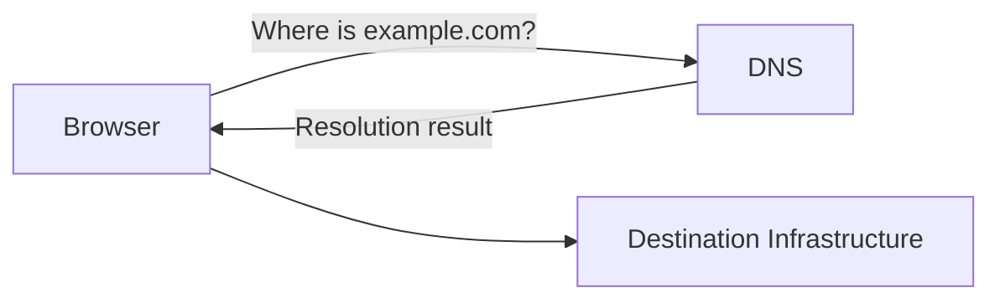

At Pareto level:

> **DNS helps map/resolve a domain or hostname toward the destination.**

We intentionally postpone deeper internals such as recursive resolvers, root servers, TLDs and authoritative servers.

---

## 3. Domain ≠ Server

Suppose you own:

```text
himanshu.dev
```

That domain is **not the application itself**.

```text
Domain
  ↓
DNS
  ↓
Server / Load Balancer / CDN / Hosting Platform
```

> [!WARNING]
> ## 🔴 Don't Confuse
> **Domain ≠ DNS ≠ Server**
>
> - Domain → human-friendly name
> - DNS → resolves the name
> - Server/infrastructure → runs or routes the workload

---

## 4. DNS Records — Pareto Set

### A Record

```text
app.example.com
       ↓ A
203.0.113.x
```

Meaning:

> Hostname → IPv4 address.

### AAAA Record

```text
app.example.com
       ↓ AAAA
2001:db8:....
```

Meaning:

> Hostname → IPv6 address.

### CNAME

```text
www.example.com
       ↓ CNAME
example.hosting-provider.com
```

Meaning:

> One hostname aliases another hostname.

---

## 5. `www` Is Not Magical

You can have:

```text
www.example.com
api.example.com
admin.example.com
docs.example.com
status.example.com
```

Possible architecture:

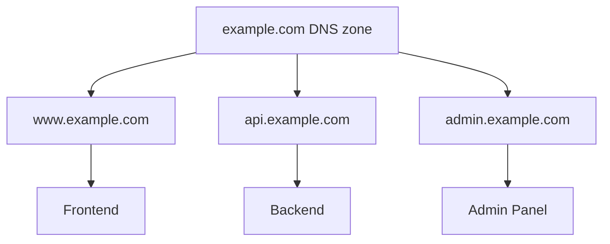

---

## 6. Domain vs URL

Example:

```text
https://shop.example.com/products?id=123
```

Breakdown:

| Part | Value |
|---|---|
| Protocol | `https://` |
| Host | `shop.example.com` |
| Path | `/products` |
| Query | `?id=123` |

> [!TIP]
> Ye distinction DNS, Nginx routing, APIs, CDNs, load balancers and Kubernetes ingress sab mein useful hogi.

---

## 7. Deeper DNS Topics — Later

Not required yet:

- Recursive resolver
- Root servers
- TLD servers
- Authoritative DNS
- TTL
- DNS caching
- MX
- TXT
- NS
- DNSSEC

> [!TIP]
> Pareto rule: pehle DNS ka role samjho. Internals tab jab cloud/networking chunk mein need aaye.

---

## 🔑 Keywords

`Domain` `Hostname` `DNS` `DNS Record` `A Record` `AAAA Record` `CNAME` `URL` `Path` `Query`

---

## 🧠 Active Recall — Short Answers

**Q1. DNS ka core job?**  
Human-friendly domain/hostname ko destination information mein resolve karna.

**Q2. Domain aur server same hain?**  
No.

**Q3. A record?**  
Hostname → IPv4 address.

**Q4. AAAA record?**  
Hostname → IPv6 address.

**Q5. CNAME?**  
Hostname → another hostname.

**Q6. `api.example.com` mein `api` kya hai?**  
Hostname/subdomain label that may point to separate infrastructure.

**Q7. Domain aur complete URL same hain?**  
No. URL also includes protocol, path, query and potentially other components.


---

# 04 — 🛜 Public/Private IP, Router, NAT & Firewall

> [!IMPORTANT]
> ## 🔵 Core Idea
> Real production systems separate public entry points from private/internal services and tightly control what network traffic is allowed.

## ⚡ Pareto — Remember This

```text
Public IP  → internet-routable addressing
Private IP → internal/private network addressing
Router     → forwards packets between networks
NAT        → translates/maps network addresses/connections
Firewall   → allow/block traffic using rules
```

---

## 1. Public vs Private IP

Home/hostel style network:

```text
                    INTERNET
                        │
                    Public IP
                        │
                   ┌────▼────┐
                   │ Router  │
                   └────┬────┘
                        │
                 PRIVATE NETWORK
             ┌──────────┼──────────┐
             ▼          ▼          ▼
          Laptop      Phone       TV
       192.168.x.x 192.168.x.x 192.168.x.x
```

### Common Private IPv4 Ranges

```text
10.0.0.0/8
172.16.0.0 – 172.31.255.255
192.168.0.0/16
```

Recognition is enough for now.

---

## 2. NAT

NAT = **Network Address Translation**

Simplified example:

```text
Laptop private IP
192.168.1.5
       ↓
     Router
       ↓ NAT
Public Internet-facing address
       ↓
    Internet
```

Router/NAT maintains translation/state so return traffic reaches the correct internal connection/device.

> [!TIP]
> Private addressing + NAT became a major way to let many devices share fewer public IPv4 addresses.

---

## 3. Router

Simplified job:

> Packets ko networks ke beech appropriate next destination ki taraf forward karna.

```text
Laptop
  ↓
Router
  ↓
ISP
  ↓
Internet routers
  ↓
Destination network
  ↓
Server
```

Useful command on Windows:

```powershell
tracert google.com
```

On Linux:

```bash
traceroute google.com
```

This helps visualize network hops.

---

## 4. Firewall

Suppose server has services:

```text
22     SSH
80     HTTP
443    HTTPS
3000   Node
27017  MongoDB
6379   Redis
```

Should entire internet access everything?

**No.**

Example rule philosophy:

```text
Internet
   │
   ├── :80    ✓
   ├── :443   ✓
   ├── :22    restricted
   ├── :3000  ✗ direct public access not needed
   ├── :27017 ✗
   └── :6379  ✗
```

> [!CAUTION]
> ## 🔴 Security Rule
> **Expose only what actually needs to be exposed.**

---

## 5. Cloud Architecture Connection

Cloud systems often look like:

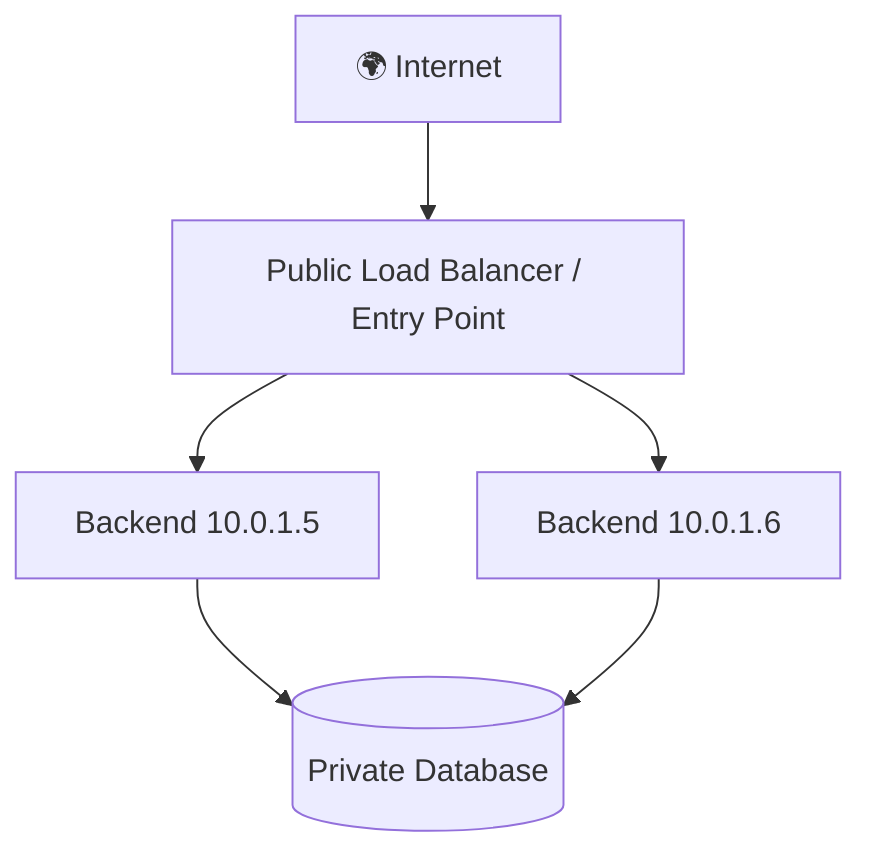

Backend and database can remain inside private networks while public traffic enters through controlled infrastructure.

This becomes highly relevant in:

- AWS VPC
- Subnets
- Security Groups
- Load Balancers
- NAT Gateways
- Kubernetes networking

---

## 6. Useful Commands

### Check route path

```powershell
tracert google.com
```

### Inspect network configuration

Windows:

```powershell
ipconfig
```

Linux:

```bash
ip addr
```

### Test reachability

```bash
ping example.com
```

> [!WARNING]
> Ping failure does not always mean a service is down. ICMP may be blocked.

---

## 🔑 Keywords

`Public IP` `Private IP` `Router` `NAT` `Firewall` `Subnet` `Network Hop` `Internet-routable`

---

## 🧠 Active Recall — Short Answers

**Q1. Private IP kya hai?**  
Private/internal network ke andar use hone wala non-publicly-routable address.

**Q2. Public IP?**  
Internet-routable addressing.

**Q3. Router kya karta hai?**  
Packets ko networks ke beech route/forward karta hai.

**Q4. NAT?**  
Network addresses/connections ko translate/map karta hai.

**Q5. Firewall?**  
Rules ke basis par network traffic allow/block karta hai.

**Q6. Database ko generally directly public internet par expose karna chahiye?**  
No.

**Q7. `192.168.x.x` commonly kis type ka address hota hai?**  
Private IPv4 address.


---

# 05 — 🧩 Frontend & Backend — Infrastructure POV

> [!IMPORTANT]
> ## 🔵 Core Idea
> DevOps perspective se sirf "frontend/backend/database" jaana enough nahi hai. Important question hai: **ye components actually run kahan ho rahe hain?**

## ⚡ Pareto — Remember This

```text
Client-side React → browser executes it
Backend Node      → server infrastructure executes it
Database          → data service / DB infrastructure
Next.js           → may involve both server-side and client-side execution
```

---

## 1. Development Environment

Local machine par:

```text
YOUR LAPTOP

React     → localhost:5173
Express   → localhost:3000
MongoDB   → localhost:27017
```

Everything ek hi machine par ho sakta hai.

---

## 2. Production Frontend — React/Vite SPA

Development:

```bash
npm run dev
```

Production:

```bash
npm run build
```

Typical output:

```text
dist/
├── index.html
└── assets/
    ├── app.js
    └── app.css
```

These are static browser-consumable assets.

Architecture:

```text
Browser
   │
   ▼
Nginx / CDN
   │
   ├── index.html
   ├── app.js
   └── app.css
```

Browser downloads the JavaScript, and the client-side React application runs primarily in the browser.

> [!IMPORTANT]
> React SPA ka production code continuously web server par UI execute nahi karta.  
> Browser JavaScript execute karta hai.

---

## 3. Backend

Backend server-side infrastructure par run karta hai.

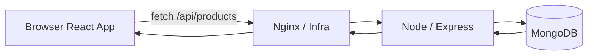

Backend handles:

- Business logic
- Authentication/authorization
- Database access
- API responses
- Server-only secrets

---

## 4. Next.js Caveat

Next.js can execute code in multiple places.

```text
NEXT.JS APP
│
├── Server-side
│   ├── Server Components
│   ├── Route Handlers
│   └── SSR
│
└── Client-side
    ├── Client Components
    └── Browser interactivity
```

> [!WARNING]
> ## 🔴 Don't Confuse
> **React SPA deployment ≠ always Next.js deployment.**

Different rendering/application models can create different infrastructure requirements.

---

## 5. Deployment Architecture

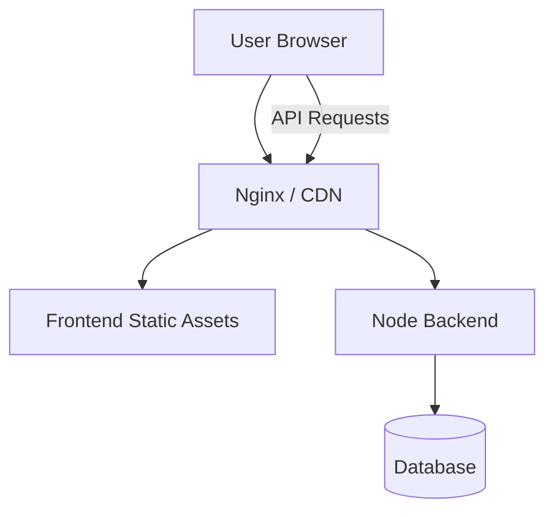

Components do not need to live on the same machine.

For example:

```text
Frontend → CDN
Backend  → Cloud VM / containers
Database → Managed DB service
```

---

## 6. Infrastructure Questions

For every application component ask:

```text
Where does it run?
Who can access it?
Which port?
How is it deployed?
How is it updated?
How is it secured?
How is it monitored?
What happens if it crashes?
```

This is DevOps thinking.

---

## 🔑 Keywords

`Frontend` `Backend` `Static Assets` `Build` `Browser Runtime` `Server Runtime` `CSR` `SSR` `SSG` `API`

---

## 🧠 Active Recall — Short Answers

**Q1. React SPA production build generally kya produce karta hai?**  
Static HTML/CSS/JS assets.

**Q2. Client-side React mainly kahan execute hota hai?**  
User's browser.

**Q3. Node backend kahan execute hota hai?**  
Server-side infrastructure.

**Q4. Frontend aur backend same machine par hona compulsory hai?**  
No.

**Q5. Next.js sirf browser mein run karta hai?**  
No. It can include both server-side and client-side execution.

**Q6. DevOps perspective ka key question?**  
Component actually run/deploy kahan ho raha hai and how traffic reaches it.


---

# 06 — ⚙️ Nginx & Reverse Proxy

> [!IMPORTANT]
> ## 🔵 Core Idea
> Nginx can act as the public-facing web layer that serves static files, terminates TLS, proxies requests to backends and can distribute traffic.

## ⚡ Pareto — Nginx ke 4 Roles

```text
1. Static file server
2. Reverse proxy
3. TLS termination
4. Load balancing
```

---

## 1. Static Web Server

Suppose website:

```text
index.html
style.css
script.js
```

Nginx can serve them directly:

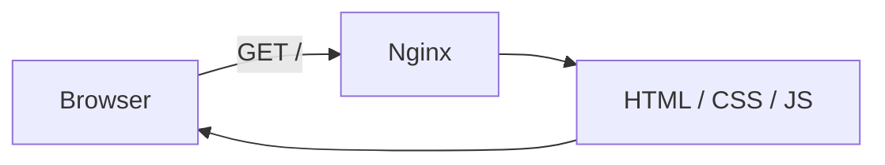

This is the role Nginx often plays in a simple static Docker webpage.

---

## 2. Why Not Expose Node Directly?

Suppose:

```text
Node → localhost:3000
```

You do not necessarily need:

```text
Internet → myapp.com:3000
```

Instead:

```text
Internet
   │ HTTPS :443
   ▼
Nginx
   │ internal proxy
   ▼
Node :3000
```

Benefits include:

- Clean public entry point
- TLS handling
- Static asset serving
- Backend hiding/routing
- Load balancing
- Centralized request controls

---

## 3. Reverse Proxy

User requests:

```text
https://myapp.com/api/products
```

Node actually listens at:

```text
localhost:3000
```

Flow:

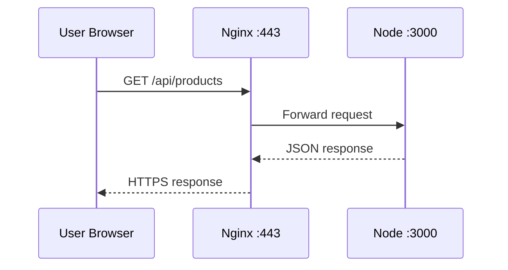

User doesn't need to know backend's internal address/port.

> [!IMPORTANT]
> Reverse proxy acts on behalf of the **server-side infrastructure**.

---

## 4. Forward Proxy vs Reverse Proxy

### Forward Proxy

```text
Client → Forward Proxy → Internet → Website
```

Represents/intermediates the client side.

### Reverse Proxy

```text
Internet → Reverse Proxy → Backend(s)
```

Represents/intermediates the server side.

> [!WARNING]
> ## 🔴 Don't Confuse
> **Forward proxy → client side**  
> **Reverse proxy → server side**

---

## 5. Routing Multiple Paths

Example:

```text
myapp.com/       → frontend
myapp.com/api/   → backend
```

Conceptual Nginx config:

```nginx
location / {
    root /var/www/frontend;
}

location /api/ {
    proxy_pass http://localhost:3000;
}
```

Do not memorize syntax yet. Architecture matters more.

---

## 6. Load Balancing Idea

When one backend isn't enough:

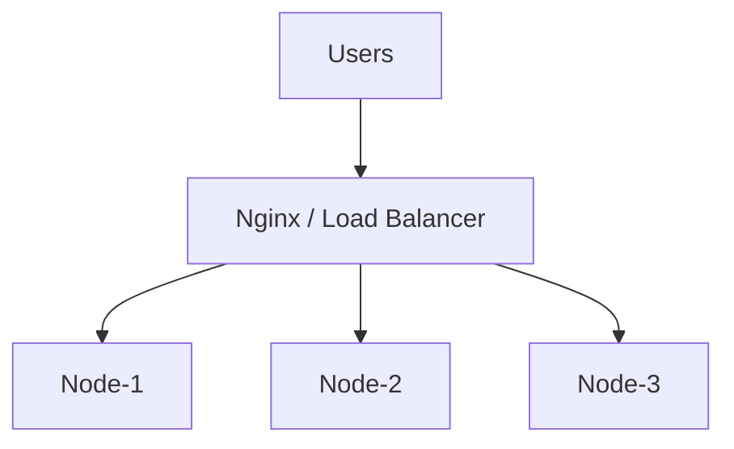

Now incoming requests can be distributed across multiple backend instances.

This is our first natural step toward horizontal scaling.

---

## 7. Firewall + Nginx Together

Public:

```text
80   ✓
443  ✓
```

Internal/private:

```text
3000   Node
27017  MongoDB
6379   Redis
```

So:

```text
Internet → Nginx :443 → Node :3000 → MongoDB :27017
```

> [!CAUTION]
> Internal ports should not be exposed publicly unless there is a specific justified requirement.

---

## 🔑 Keywords

`Nginx` `Web Server` `Static Files` `Reverse Proxy` `Forward Proxy` `Upstream` `Proxy Pass` `Load Balancer` `TLS Termination`

---

## 🧠 Active Recall — Short Answers

**Q1. Nginx ke Pareto four roles?**  
Static serving, reverse proxy, TLS termination, load balancing.

**Q2. Reverse proxy kya karta hai?**  
Client requests receive karke appropriate backend ko forward karta hai.

**Q3. Node port `3000` public expose karna compulsory hai?**  
No.

**Q4. Forward proxy kis side ko represent karta hai?**  
Client side.

**Q5. Reverse proxy kis side ko represent karta hai?**  
Server side.

**Q6. Static Docker webpage mein Nginx ka main role kya ho sakta hai?**  
Static web server.

**Q7. `Nginx → Node:3000` mein Nginx ka role?**  
Reverse proxy.

**Q8. Multiple Node instances ke saath Nginx aur kya kar sakta hai?**  
Load balancing.


---

# 07 — 🔒 TLS, HTTPS & Certificates

> [!IMPORTANT]
> ## 🔵 Core Idea
> TLS allows clients and servers to establish authenticated, encrypted communication with integrity protection.

## ⚡ Pareto — Remember This

```text
HTTPS = HTTP protected by TLS

TLS gives us:
1. Confidentiality
2. Integrity
3. Authentication
```

---

## 1. Why TLS?

Without transport encryption, someone capable of intercepting the network path could potentially observe or modify traffic.

We want:

```text
CONFIDENTIALITY
      +
INTEGRITY
      +
AUTHENTICATION
```

---

## 2. Encryption Mental Model

Without TLS:

```text
Client → readable application data → Network → Server
```

With TLS:

```text
Client
  ↓ encrypt
Ciphertext over network
  ↓ decrypt
Server
```

The goal is that passive observers cannot simply read plaintext application data.

---

## 3. Authentication Problem

Encryption alone isn't enough.

Browser must also answer:

> "Am I really talking to `example.com`?"

Server presents a **digital certificate** and cryptographic proof during TLS setup.

Simplified:

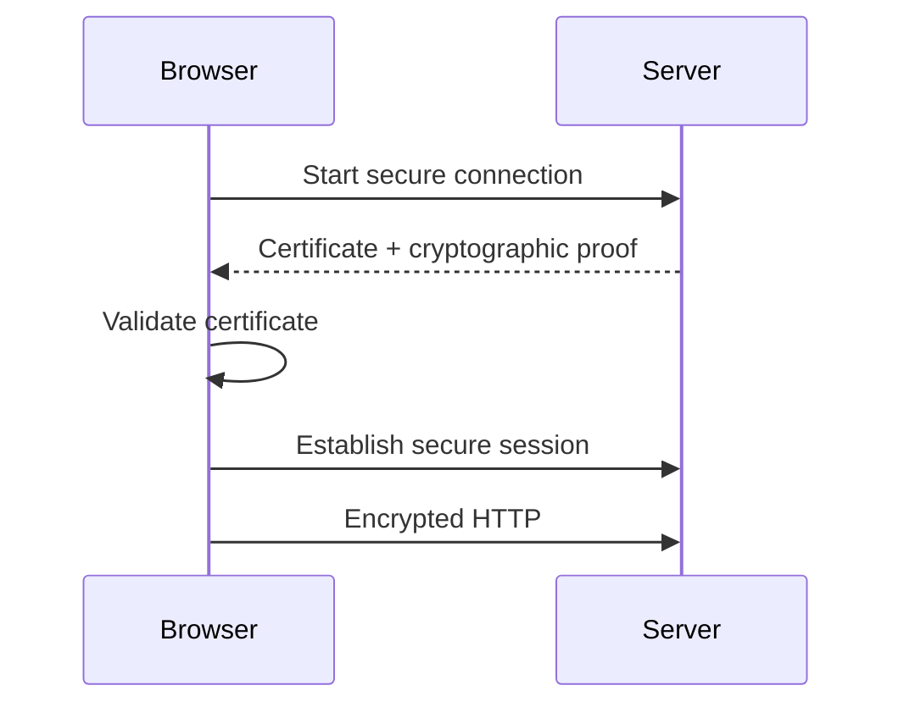

---

## 4. Certificate Authority — CA

CA = **Certificate Authority**

Browser/OS maintains trust stores containing trusted certificate authorities.

Certificates help bind:

```text
Domain identity
      ↕
Cryptographic key material
```

Examples of CAs include Let's Encrypt and commercial providers.

---

## 5. Browser Validation — Simplified

Browser checks concepts such as:

```text
Does certificate match the hostname?
Is it valid for the current time?
Is the trust chain acceptable?
Has setup completed correctly?
```

If validation fails, browser can show a security warning.

---

## 6. TLS Termination

A common architecture:

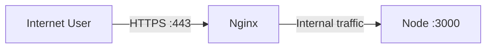

Nginx handles the internet-facing TLS connection.

This is called:

> **TLS termination**

The backend does not necessarily need to individually handle the external TLS handshake itself.

---

## 7. SSL vs TLS

You'll hear both terms.

> [!WARNING]
> ## 🔴 Don't Confuse
> Modern HTTPS uses **TLS**.  
> People still commonly say "SSL certificate", but SSL itself is obsolete.

---

## 8. What TLS Does NOT Automatically Solve

TLS does not magically make an application fully secure.

It does **not** replace:

- Authentication
- Authorization
- Secure coding
- Input validation
- Firewalling
- Secrets management
- Patch management

> [!CAUTION]
> HTTPS protects communication in transit; it is not a complete security architecture.

---

## 🔑 Keywords

`TLS` `HTTPS` `Encryption` `Confidentiality` `Integrity` `Authentication` `Certificate` `CA` `Trust Chain` `TLS Handshake` `TLS Termination`

---

## 🧠 Active Recall — Short Answers

**Q1. HTTPS kis protocol se protect hota hai?**  
TLS.

**Q2. TLS ke three core security goals?**  
Confidentiality, integrity and authentication.

**Q3. Certificate ka basic role?**  
Server identity/authentication establish karne mein help karna.

**Q4. CA ka full form?**  
Certificate Authority.

**Q5. TLS termination kya hai?**  
Front-facing component incoming TLS handle karta hai and traffic backend ko forward karta hai.

**Q6. HTTPS hone ka matlab application fully secure hai?**  
No.

**Q7. SSL aur TLS mein modern protocol kaunsa hai?**  
TLS.


---

# 08 — 🔁 End-to-End Website Request Lifecycle

> [!IMPORTANT]
> ## 🎯 Goal
> Browser mein `https://shop.com/products` type karne se lekar UI render hone tak ka complete flow.

## ⚡ Master Architecture

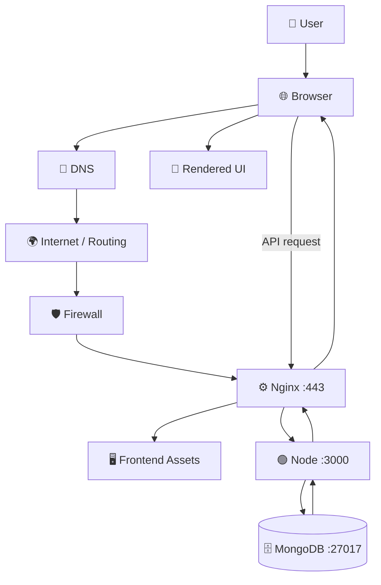

---

# Walkthrough

## Step 1 — Browser Parses URL

User enters:

```text
https://shop.com/products
```

Breakdown:

```text
Protocol → HTTPS
Host     → shop.com
Path     → /products
```

---

## Step 2 — DNS Resolution

Browser/system needs to find destination information for:

```text
shop.com
```

Conceptually:

```text
shop.com
   ↓
DNS
   ↓
IP / destination infrastructure
```

---

## Step 3 — Network Routing

Traffic moves through networking infrastructure:

```text
Laptop
  ↓
Wi‑Fi / Router
  ↓
ISP
  ↓
Internet routers
  ↓
Destination network
```

---

## Step 4 — Transport Connection

For typical HTTP/1.1 or HTTP/2 over TCP:

```text
TCP connection
      ↓
TLS handshake
```

For HTTP/3:

```text
QUIC over UDP
```

Pareto focus remains HTTP/HTTPS + TCP mental model for now.

---

## Step 5 — TLS Certificate Validation

Server presents certificate.

Browser validates concepts such as:

```text
Hostname match?
Trusted certificate chain?
Validity period?
Cryptographic proof?
```

---

## Step 6 — Secure Session Established

TLS session keys are established.

Now HTTP traffic can travel securely.

---

## Step 7 — Browser Sends HTTP Request

Conceptually:

```http
GET /products
Host: shop.com
```

---

## Step 8 — Firewall Allows Public Traffic

Internet-facing rules may allow:

```text
443 ✓
80  ✓ or redirected
```

while internal ports remain unavailable publicly.

---

## Step 9 — Nginx Receives Request

Nginx can:

- Handle TLS
- Serve static assets
- Route `/api/*`
- Proxy backend requests
- Load balance later

---

## Step 10 — Frontend Loads

For a React SPA, browser receives:

```text
index.html
app.js
app.css
```

Then browser executes React.

---

## Step 11 — Frontend Calls API

Example:

```js
fetch("/api/products");
```

Flow:

```text
Browser
   ↓ HTTPS
Nginx
   ↓ proxy
Node :3000
```

---

## Step 12 — Backend Executes Logic

Example route:

```js
app.get("/api/products", async (req, res) => {
  // fetch products
});
```

Backend may:

- Validate request
- Authenticate user
- Apply business logic
- Query database

---

## Step 13 — Database Query

```text
Node
 ↓
MongoDB
 ↓
Products
```

---

## Step 14 — Response Travels Back

```text
MongoDB
   ↓
Node
   ↓
Nginx
   ↓
HTTPS
   ↓
Browser
```

Example JSON:

```json
[
  {
    "name": "Laptop",
    "price": 60000
  }
]
```

---

## Step 15 — UI Renders

```text
JSON
 ↓
React state
 ↓
DOM/UI
 ↓

┌────────────────────┐
│ Laptop             │
│ ₹60,000            │
│ [Add to Cart]      │
└────────────────────┘
```

---

## 🧠 One-Line Master Story

> **Domain resolves through DNS → network reaches public infrastructure → TLS secures communication → Nginx routes traffic → frontend runs in browser → backend executes logic → database returns data → response returns to UI.**

---

## 🔑 Keywords

`URL Parsing` `DNS Resolution` `Routing` `TCP Connection` `TLS Handshake` `Certificate Validation` `HTTP Request` `Reverse Proxy` `API` `Database Query` `HTTP Response` `Rendering`

---

## 🧠 Active Recall — Short Answers

**Q1. Browser pehle URL se kya identify karta hai?**  
Protocol, host and path.

**Q2. Domain se destination kaun resolve karta hai?**  
DNS.

**Q3. HTTPS ke secure session se pehle kya hota hai?**  
TLS handshake/certificate validation.

**Q4. Public request ko frontend/backend tak kaun route kar sakta hai?**  
Nginx/reverse proxy or equivalent infrastructure.

**Q5. React SPA API data ka typical flow?**  
Browser → Nginx → backend → DB → backend → browser.

**Q6. Database direct browser ko response bhejta hai?**  
Usually no; backend mediates application access.

**Q7. Final UI rendering client-side React case mein kahan hoti hai?**  
Browser.


---

# 09 — 🏗️ Architecture Evolution

> [!IMPORTANT]
> ## 🔵 Core Idea
> Large systems ko giant diagram ki tarah memorize mat karo.  
> **Har new box ek problem solve karta hai.**

---

## Version 0 — One Machine

```text
User
 ↓
Server
```

Good for:

- Small demo
- Learning
- Tiny workloads

Problem:

- No separation
- Single point of failure
- Hard to scale

---

## Version 1 — Full-Stack App

```text
User
 ↓
Node
 ↓
Database
```

Now application logic and persistent data exist.

Problem:

- Public backend exposure
- TLS/static routing concerns
- Single backend instance

---

## Version 2 — Nginx Front Door

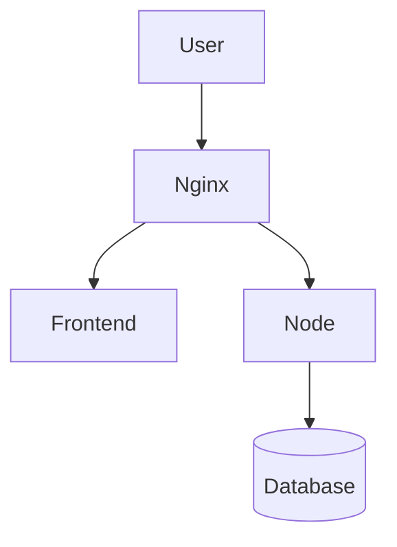

Nginx adds:

- Static serving
- Reverse proxy
- TLS termination
- Central public entry

---

## Version 3 — Multiple Backend Instances

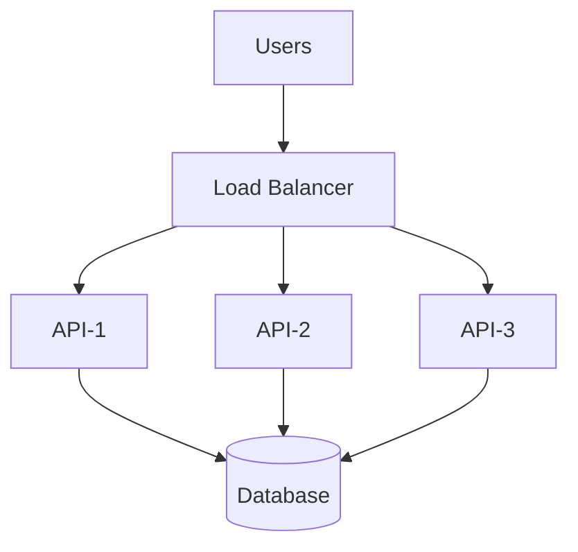

Problem solved:

> One backend is not enough.

Concept introduced:

> **Horizontal scaling**

---

## Version 4 — Cache

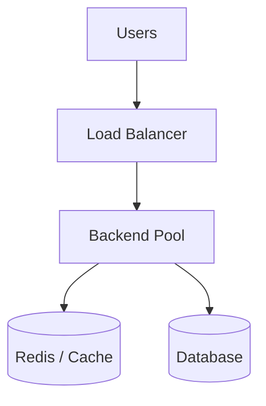

Why cache?

- Repeated expensive reads
- Reduce DB pressure
- Faster responses for hot data

---

## Version 5 — CDN

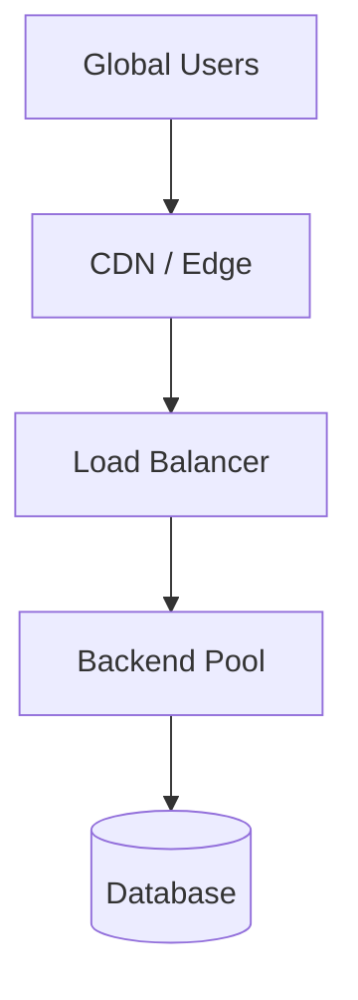

Why CDN?

- Users geographically distributed
- Static/media content closer to users
- Reduce origin load

---

## Version 6 — Service-Oriented / Microservice Shape

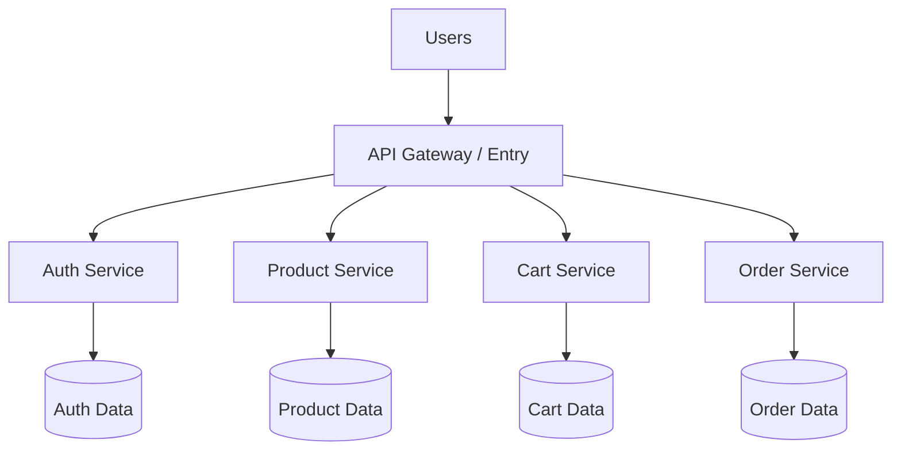

Why split?

Possible reasons include:

- Independent scaling
- Team ownership
- Different data models
- Deployment isolation
- Domain boundaries

> [!WARNING]
> Microservices are not automatically better. They add operational complexity.

---

## Version 7 — Event-Driven Work

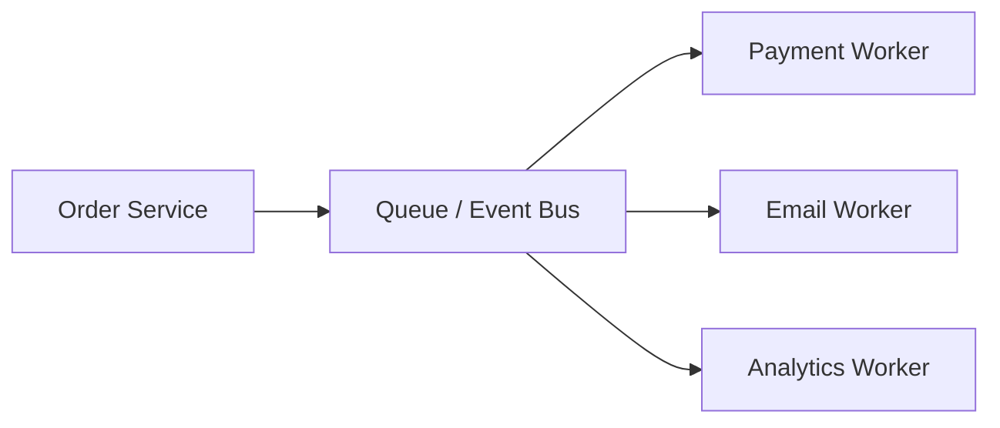

Why queue/events?

- Work need not happen synchronously
- Decouple services
- Buffer bursts
- Retry background work

---

## Amazon-ish Mental Model

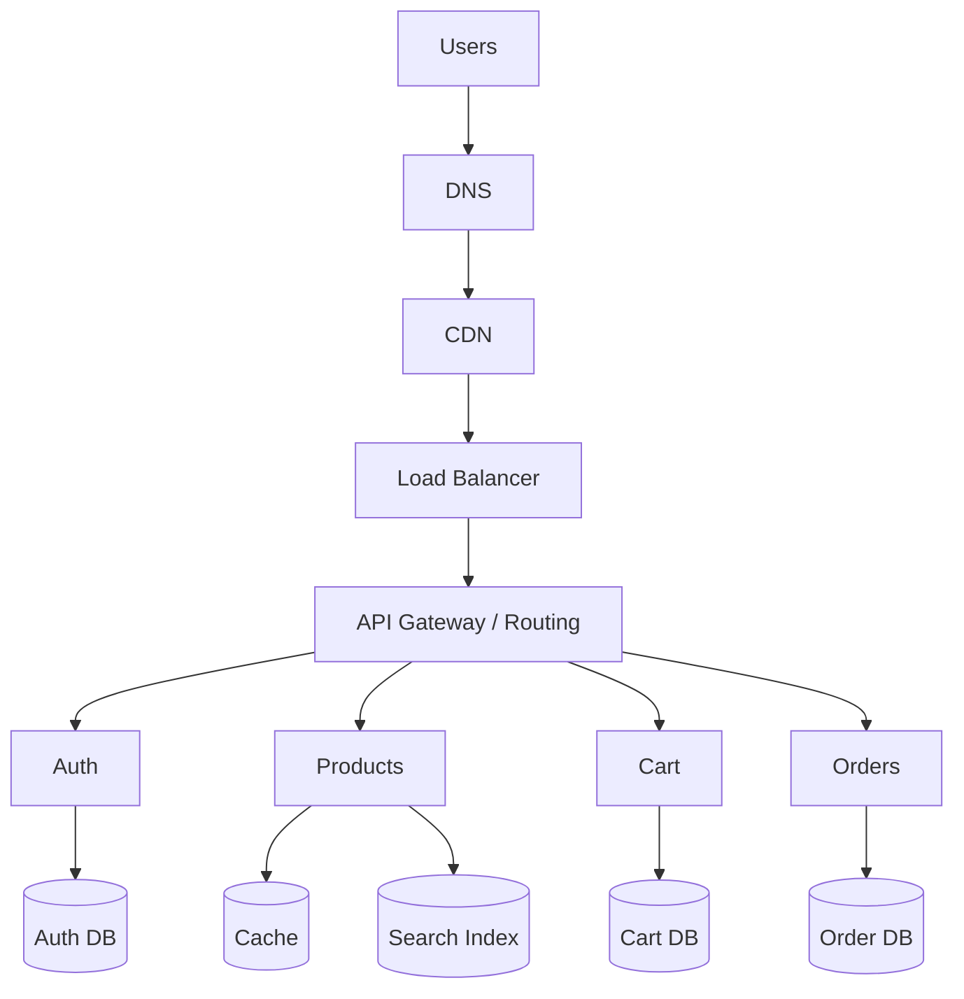

Not actual Amazon internals—this is a **learning model**.

---

## Netflix-ish Difference

Streaming systems care heavily about:

```text
Video storage
Encoding
CDN / edge delivery
Playback
Recommendations
Profiles
Subscriptions
Analytics
```

A simplified split:

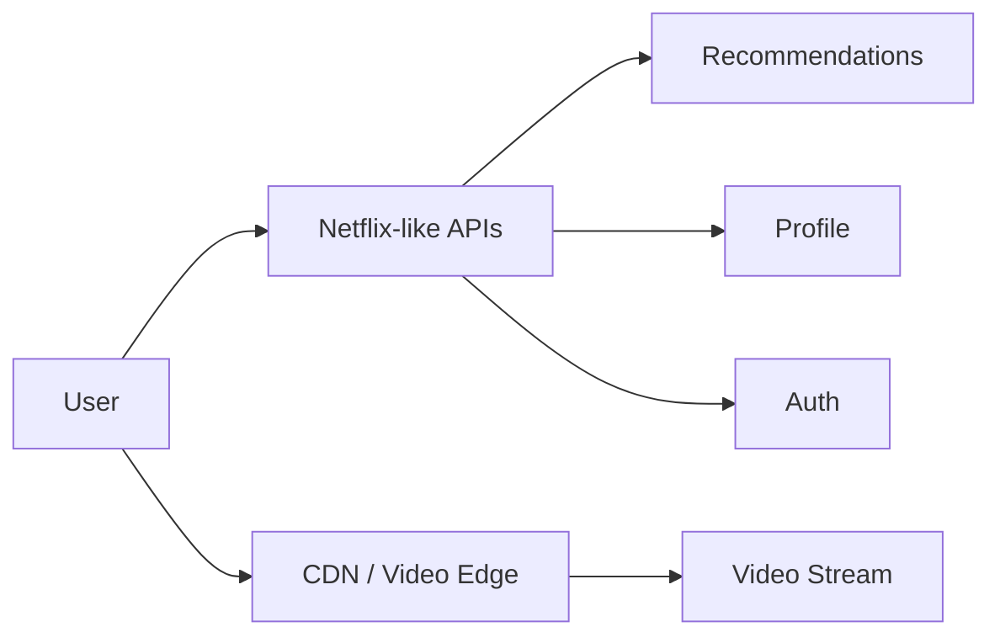

Key insight:

> API data and massive media delivery may take very different paths.

---

## 🧠 Architecture Reasoning Table

| New Box | Problem It Solves |
|---|---|
| DNS | Human-friendly discovery |
| Nginx / Reverse Proxy | Front door, routing, TLS, static serving |
| Load Balancer | Multiple backend instances |
| Cache / Redis | Repeated expensive access |
| CDN | Geographic content delivery |
| Queue | Async/background work |
| Multiple services | Independent domains/scaling/ownership |
| Monitoring | Understand system health |
| Kubernetes | Manage containerized workloads at scale |
| Terraform | Reproducible infrastructure as code |

---

## 🧠 Active Recall — Short Answers

**Q1. Large architecture kaise learn karni chahiye?**  
Har new component ko us problem se connect karke jo woh solve karta hai.

**Q2. Load balancer kyun?**  
Traffic multiple backend instances mein distribute karne ke liye.

**Q3. Cache kyun?**  
Repeated expensive access ko faster aur cheaper banane ke liye.

**Q4. CDN kyun?**  
Content ko geographically users ke closer serve karne ke liye.

**Q5. Queue kyun?**  
Async/background work ko decouple and buffer karne ke liye.

**Q6. Microservices always better?**  
No. They add significant operational complexity.


---

# 10 — 🔑 Unit 01 Keywords Cheat Sheet

> [!TIP]
> ## ⚡ Interview Revision
> Is page ko vocabulary flash-sheet ki tarah use karo.

| Keyword | One-Line Memory |
|---|---|
| **Internet** | Network of networks |
| **Web** | HTTP/HTTPS-based service ecosystem on the internet |
| **Client** | Request initiate karta hai |
| **Server** | Requests/services serve karta hai |
| **IP Address** | Network addressing/destination |
| **Port** | Machine par network service endpoint |
| **localhost** | This machine / loopback |
| **HTTP** | Web request/response protocol |
| **HTTPS** | HTTP protected by TLS |
| **GET** | Retrieve/read resource |
| **POST** | Create/submit |
| **PUT** | Replace/update |
| **PATCH** | Partial update |
| **DELETE** | Delete |
| **200** | OK |
| **201** | Created |
| **301/302** | Redirect |
| **400** | Bad request |
| **401** | Not authenticated / auth required |
| **403** | Forbidden |
| **404** | Not found |
| **500** | Server-side internal error |
| **502** | Gateway/proxy upstream failure |
| **503** | Service unavailable |
| **TCP** | Reliable ordered byte-stream transport |
| **UDP** | Datagram transport, fewer built-in guarantees |
| **QUIC** | Modern transport over UDP used by HTTP/3 |
| **DNS** | Domain/hostname resolution |
| **Domain** | Human-friendly name |
| **Hostname** | Network-facing name such as `api.example.com` |
| **A Record** | Hostname → IPv4 |
| **AAAA Record** | Hostname → IPv6 |
| **CNAME** | Hostname → another hostname |
| **URL** | Protocol + host + path + query etc. |
| **Public IP** | Internet-routable address |
| **Private IP** | Internal/private network address |
| **Router** | Forwards packets between networks |
| **NAT** | Address/connection translation/mapping |
| **Firewall** | Allow/block traffic using rules |
| **Frontend** | User-facing client application/assets |
| **Backend** | Server-side application logic/API |
| **Database** | Persistent data system |
| **Static Asset** | HTML/CSS/JS/image etc. served as file |
| **Nginx** | Web server, proxy, TLS termination, load balancer |
| **Web Server** | Serves HTTP content/requests |
| **Reverse Proxy** | Server-side intermediary forwarding requests |
| **Forward Proxy** | Client-side intermediary |
| **Upstream** | Backend service a proxy forwards to |
| **Load Balancer** | Distributes traffic across instances |
| **TLS** | Secure transport protocol |
| **Certificate** | Helps authenticate server identity |
| **CA** | Certificate Authority |
| **TLS Handshake** | Establishes authenticated secure session |
| **TLS Termination** | Front layer handles incoming TLS |
| **CDN** | Content closer to geographically distributed users |
| **Cache** | Fast temporary storage for repeated access |
| **Redis** | Common in-memory cache/state system |
| **Queue** | Buffer/decouple asynchronous work |
| **Horizontal Scaling** | Add more instances instead of only bigger machine |
| **Reverse Proxy Routing** | Route requests by host/path to backends |
| **API** | Programmatic application interface |
| **SSR** | Server-side rendering |
| **CSR** | Client-side rendering |
| **SSG** | Static site generation |

---

## 🔴 Common Confusions

| Don't Confuse | Correct Difference |
|---|---|
| Internet vs Web | Internet = network; Web = HTTP/HTTPS service |
| Domain vs Server | Name vs workload infrastructure |
| DNS vs Domain | Resolution system vs name |
| IP vs Port | Machine/network destination vs service endpoint |
| HTTP vs TCP | App protocol vs transport |
| HTTPS vs HTTP | HTTP protected by TLS vs unprotected HTTP |
| Forward vs Reverse Proxy | Client-side vs server-side intermediary |
| Nginx vs Node | Infrastructure/web layer vs application runtime |
| React SPA vs Next.js | Mostly client runtime vs mixed server/client possibilities |
| TLS vs Full Security | Secure transport vs complete application security |

---

## ⚡ Absolute Pareto 15

If you remember only 15 terms:

```text
DNS
IP
Port
HTTP
HTTPS
TCP
Public IP
Private IP
Firewall
Nginx
Reverse Proxy
TLS
Certificate
Backend
Database
```


---

# 11 — 🧠 Unit 01 Active Recall

> [!IMPORTANT]
> Rule: pehle answer mentally bolo. **Uske baad one-line answer dekho.**

---

## Level 1 — Foundation

**Q1. Internet aur Web same hain?**  
**A.** No. Internet underlying network hai; Web HTTP/HTTPS-based service ecosystem hai.

**Q2. Server fundamentally kya hai?**  
**A.** Computer/software system that listens for and serves requests.

**Q3. IP address ka role?**  
**A.** Network destination ko address/locate karna.

**Q4. Port ka role?**  
**A.** Correct network service endpoint identify karna.

**Q5. `localhost:3000` ka meaning?**  
**A.** Apni machine par port 3000 par listening service.

---

## Level 2 — HTTP & Transport

**Q6. HTTP ka basic model?**  
**A.** Request → Response.

**Q7. `GET` generally kisliye?**  
**A.** Data/resource retrieve karne ke liye.

**Q8. `POST` generally kisliye?**  
**A.** Resource/action create/submit karne ke liye.

**Q9. `404`?**  
**A.** Requested resource not found.

**Q10. `500`?**  
**A.** Server-side internal error.

**Q11. `502`?**  
**A.** Gateway/proxy ko upstream service se valid response nahi mila.

**Q12. TCP ka killer feature?**  
**A.** Reliable ordered byte-stream transport.

**Q13. UDP ka fundamental difference?**  
**A.** Datagram transport with no built-in reliable/ordered delivery guarantee.

**Q14. HTTP/3 kis transport technology ka use karta hai?**  
**A.** QUIC over UDP.

---

## Level 3 — DNS

**Q15. DNS ka core job?**  
**A.** Domain/hostname ko destination information mein resolve karna.

**Q16. Domain aur server same hain?**  
**A.** No.

**Q17. A record?**  
**A.** Hostname → IPv4.

**Q18. AAAA record?**  
**A.** Hostname → IPv6.

**Q19. CNAME?**  
**A.** Hostname → another hostname.

**Q20. `api.example.com` kya ho sakta hai?**  
**A.** Separate hostname/subdomain pointing to API infrastructure.

---

## Level 4 — Networking

**Q21. Private IP kya hai?**  
**A.** Private/internal network ke andar use hone wala address.

**Q22. Public IP?**  
**A.** Internet-routable address.

**Q23. Router ka role?**  
**A.** Packets ko networks ke beech appropriate next destination ki taraf forward karna.

**Q24. NAT?**  
**A.** Network addresses/connections ko translate/map karta hai.

**Q25. Firewall?**  
**A.** Rules ke basis par traffic allow/block karta hai.

**Q26. Database directly internet expose karna generally desirable hai?**  
**A.** No.

---

## Level 5 — Frontend / Backend

**Q27. React SPA production build typically kya produce karta hai?**  
**A.** Static browser-consumable HTML/CSS/JS assets.

**Q28. Client-side React primarily kahan execute hota hai?**  
**A.** User's browser.

**Q29. Node backend kahan execute hota hai?**  
**A.** Server-side infrastructure.

**Q30. Frontend/backend same machine par hona compulsory hai?**  
**A.** No.

**Q31. Next.js sirf browser mein run karta hai?**  
**A.** No, it can include both server-side and client-side execution.

---

## Level 6 — Nginx

**Q32. Nginx ke Pareto four roles?**  
**A.** Static serving, reverse proxy, TLS termination, load balancing.

**Q33. Reverse proxy?**  
**A.** Client request receive karke appropriate backend ko forward karta hai.

**Q34. Forward proxy kis side ko represent karta hai?**  
**A.** Client side.

**Q35. Reverse proxy kis side ko represent karta hai?**  
**A.** Server side.

**Q36. Node `3000` ko public expose karna compulsory hai?**  
**A.** No.

**Q37. Nginx simple static Docker webpage mein kya karta tha?**  
**A.** Static files serve karta tha.

---

## Level 7 — TLS

**Q38. HTTPS kya hai?**  
**A.** HTTP protected by TLS.

**Q39. TLS ke three core goals?**  
**A.** Confidentiality, integrity and authentication.

**Q40. Certificate ka basic role?**  
**A.** Server identity/authentication establish karne mein help karna.

**Q41. CA?**  
**A.** Certificate Authority.

**Q42. TLS termination?**  
**A.** Front layer incoming TLS handle karta hai and traffic onward forward karta hai.

**Q43. HTTPS means application fully secure?**  
**A.** No.

---

## Level 8 — Full Architecture

**Q44. Browser `https://shop.com/products` type karne ke baad first conceptual tasks?**  
**A.** URL parse + DNS resolution.

**Q45. DNS ke baad?**  
**A.** Network routes traffic to destination infrastructure.

**Q46. HTTPS request secure kaise hota hai?**  
**A.** TLS handshake and encrypted session.

**Q47. Public entry layer backend tak request kaise bhej sakta hai?**  
**A.** Reverse proxy/routing.

**Q48. React SPA API data flow?**  
**A.** Browser → Nginx → backend → database → backend → browser.

**Q49. Load balancer kyun?**  
**A.** Traffic multiple backend instances mein distribute karne ke liye.

**Q50. Cache kyun?**  
**A.** Repeated expensive access faster/cheaper banane ke liye.

**Q51. CDN kyun?**  
**A.** Content users ke geographically closer serve karne ke liye.

**Q52. Queue kyun?**  
**A.** Async/background work decouple aur buffer karne ke liye.

---

# 🔥 Interview Challenge — Explain Without Notes

Try verbally explaining:

```text
User types amazon.in
↓
DNS
↓
network routing
↓
TLS/HTTPS
↓
public entry/load balancer
↓
application services
↓
cache/database/search
↓
response
```

If tum 2–3 minutes mein confidently explain kar pao, Unit 01 ka foundation strong hai.


---

# 12 — ⚡ Unit 01 — 2-Minute Revision

> [!TIP]
> Is page ko interview, quiz ya next chunk se pehle read karo.

## 🌐 Master Flow

```text
Domain
  ↓
DNS
  ↓
IP / destination
  ↓
Internet routing
  ↓
TCP / QUIC
  ↓
TLS
  ↓
HTTP
  ↓
Firewall
  ↓
Nginx / Reverse Proxy
  ↓
Backend
  ↓
Database
  ↓
Response
  ↓
Browser UI
```

## 🔑 Fast Definitions

**Internet** → network of networks  
**Web** → HTTP/HTTPS-based ecosystem  
**IP** → network destination/address  
**Port** → network service endpoint  
**DNS** → domain/hostname resolution  
**HTTP** → request/response protocol  
**HTTPS** → HTTP protected by TLS  
**TCP** → reliable ordered byte stream  
**UDP** → datagrams, fewer built-in guarantees  
**Public IP** → internet-routable  
**Private IP** → internal/private network  
**Router** → packets between networks  
**NAT** → address/connection translation  
**Firewall** → allow/block traffic  
**Nginx** → web server/proxy/load balancer/TLS endpoint  
**Reverse Proxy** → front door forwarding to backend  
**TLS** → encrypted/authenticated transport  
**Certificate** → helps verify server identity  
**A** → hostname → IPv4  
**AAAA** → hostname → IPv6  
**CNAME** → hostname → hostname  
**Frontend** → browser-facing UI/assets  
**Backend** → server-side logic/API  
**Database** → persistent data store  
**Load Balancer** → distribute requests  
**CDN** → content closer to users  
**Cache** → fast repeated access  
**Queue** → asynchronous work buffer

## 🔴 Five Confusions to Avoid

1. **Internet ≠ Web**
2. **Domain ≠ Server**
3. **IP ≠ Port**
4. **HTTP ≠ TCP**
5. **Nginx ≠ Node**

## ⚡ Nginx Pareto

```text
Static serving
Reverse proxy
TLS termination
Load balancing
```

## 🔒 TLS Pareto

```text
Confidentiality
Integrity
Authentication
```

## 🧠 One-Line Architecture

> **DNS finds the destination, networking reaches it, TLS secures it, Nginx routes it, backend processes it, database supplies data, browser renders the result.**
