# 🐧 DevOps From First Principles — Unit 02 Complete Notes
> **Linux + Networking + SSH + Manual Production Deployment**  
> Designed for Obsidian + GitHub. Visuals use Mermaid so the notes stay self-contained and render well on both platforms.

---

# 🗺️ Unit Map

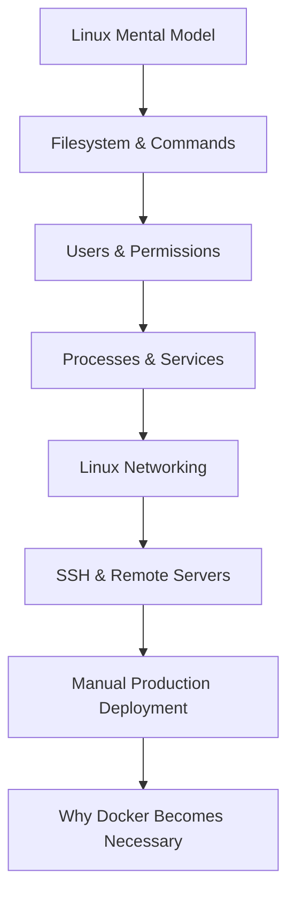

> [!IMPORTANT]
> ## 🔵 Unit 02 Core Idea
> DevOps ka base cloud service names ya Docker commands nahi hai.  
> **Pehle ek Linux machine ko samjho: files kahan hain, process kaise run hota hai, port kaise listen hota hai, network se request kaise aati hai, aur remote server ko safely kaise control karte hain.**

---

# 01 — 🐧 Linux Mental Model

## 1. Linux kya hai?

Linux technically **kernel** hai.

Kernel ka job:

```text
Applications
    ↓
Linux Kernel
    ↓
CPU / RAM / Disk / Network / Devices
```

Kernel manages:

- CPU scheduling
- memory
- processes
- filesystems
- devices
- networking

Ubuntu, Debian, Fedora etc. **Linux distributions** hain.

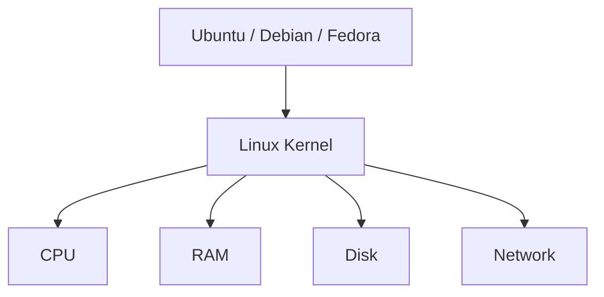

### ⚡ Pareto

```text
Linux Kernel = core operating-system engine
Distribution = kernel + tools + package manager + defaults + ecosystem
Ubuntu = one Linux distribution
```

---

## 2. Shell vs Terminal

Ye dono same nahi hain.

```text
Terminal
↓
window/interface

Shell
↓
command interpreter

Bash
↓
one popular shell
```

Example:

```bash
pwd
```

Terminal tumhari command shell ko deta hai; shell command interpret/execute karta hai.

> [!TIP]
> DevOps mein Bash important hai because servers ko GUI ke bina commands se manage karna common hai.

---

# 02 — 📁 Linux Filesystem

Windows mein tum familiar ho:

```text
C:\
D:\
```

Linux filesystem ek root tree se start hota hai:

```text
/
```

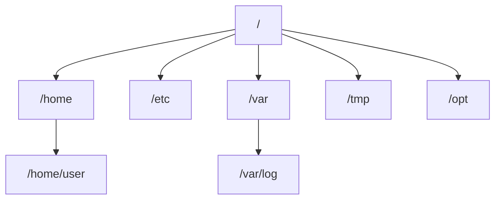

## Important directories

### `/home`

Normal users ke personal directories.

```text
/home/himanshu
/home/ubuntu
```

### `/etc`

System/application configuration.

Examples:

```text
/etc/nginx/
/etc/systemd/
/etc/ssh/
```

### `/var`

Frequently changing runtime/system data.

Important:

```text
/var/log
```

### `/tmp`

Temporary files.

### `/opt`

Optional/add-on software ke liye commonly used location.

---

# 03 — 🧭 Paths

## Absolute path

Root `/` se start:

```text
/home/ubuntu/app/server.js
```

## Relative path

Current directory se:

```text
app/server.js
```

Mental model:

```text
Absolute = full address
Relative = current location se directions
```

---

# 04 — 💻 Essential Linux Commands

## Where am I?

```bash
pwd
```

> **Print Working Directory**

## Files dekhna

```bash
ls
ls -l
ls -a
ls -la
```

```text
-l = detailed listing
-a = hidden files too
```

Hidden files usually `.` se start hote hain:

```text
.env
.git
.ssh
.bashrc
.obsidian
```

## Directory move

```bash
cd folder
cd ..
cd ~
cd /
```

```text
.. = parent
~  = current user's home
/  = filesystem root
```

## Create

```bash
touch notes.txt
mkdir logs
mkdir -p app/logs/archive
```

## Copy / Move

```bash
cp file.txt backup.txt
cp -r app app-backup
mv old.txt new.txt
```

`mv` rename aur move dono kar sakta hai.

## Read files

```bash
cat file.txt
less file.txt
tail file.txt
tail -f app.log
```

`tail -f` logs ke liye especially useful hai.

## Search text

```bash
grep "ERROR" app.log
```

## Delete

```bash
rm file.txt
rm -r folder
rm -rf folder
```

> [!DANGER]
> `rm -rf` powerful aur destructive hai. Linux mein recycle bin wali safety assume mat karo.

---

# 05 — 🔗 Pipes, Redirection, Command Chaining

## Pipe `|`

Ek command ka output next command ka input.

```bash
ps aux | grep node
```

Mental:


## `>`

Output overwrite:

```bash
echo "hello" > file.txt
```

## `>>`

Append:

```bash
echo "next line" >> file.txt
```

## `&&`

Next command tabhi chale jab previous successful ho.

```bash
npm install && npm start
```

---

# 06 — 👥 Users, Groups & Permissions

Linux multi-user system hai.

Possible accounts:

```text
root
ubuntu
developer
deploy
www-data
postgres
```

Sab users humans hona zaroori nahi. Services ke dedicated accounts bhi ho sakte hain.

---

## `whoami`

```bash
whoami
```

Current user.

## `id`

```bash
id
```

User ID, group IDs etc.

## `groups`

```bash
groups
```

User kin groups ka member hai.

---

# 07 — 👑 Root & `sudo`

`root` = superuser.

Root almost everything kar sakta hai.

Normal user:

```text
limited privilege
```

`sudo`:

```text
normal user
↓
sudo
↓
authorized privileged command
```

> [!IMPORTANT]
> `sudo` ka matlab permanently root ban jaana nahi. Usually ek specific command elevated privileges ke saath execute hoti hai.

### Principle of Least Privilege

> User/process ko **sirf utna access do jitna required hai**.

Ye principle later Docker, AWS IAM, Kubernetes, database accounts sab jagah return karega.

---

# 08 — 🔐 Linux Permissions

`ls -l` output:

```text
-rwxr-xr--
```

Break:

```text
- | rwx | r-x | r--
    │      │      │
 owner   group  others
```

Meaning:

```text
r = read
w = write
x = execute
```

## Numeric permissions

```text
r = 4
w = 2
x = 1
```

Example:

```text
7 = rwx = 4+2+1
5 = r-x = 4+1
4 = r-- = 4
```

So:

```bash
chmod 755 script.sh
```

means:

```text
owner  = rwx
group  = r-x
others = r-x
```

Common:

```text
755 → executable directories/scripts
644 → regular readable files
```

> [!CAUTION]
> Permission choice context-dependent hai. `777` ko universal fix mat samjho.

---

# 09 — `chmod` vs `chown`

## `chmod`

**WHAT permissions?**

```bash
chmod +x deploy.sh
chmod 755 deploy.sh
```

## `chown`

**WHO owns it?**

```bash
sudo chown ubuntu:ubuntu app
```

Mental lock:

```text
chmod → permissions
chown → ownership
```

---

# 10 — ⚙️ Processes

Application run karoge:

```bash
node server.js
```

OS ek **process** create karega.

A process has things like:

```text
PID
user
CPU usage
memory usage
open files
network sockets
```

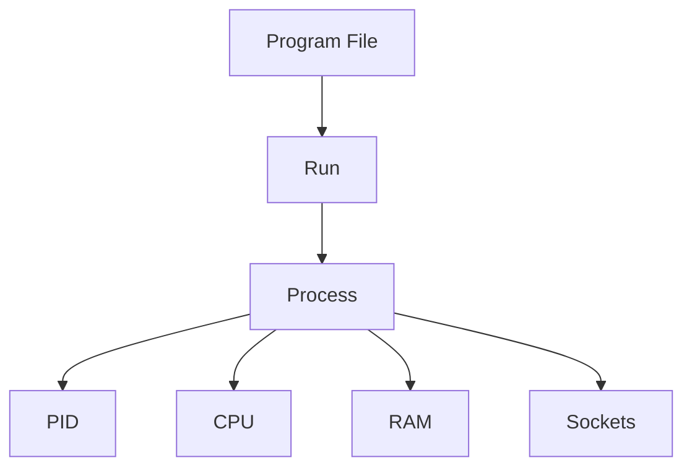

## Inspect processes

```bash
ps
ps aux
ps aux | grep node
```

Live system:

```bash
top
```

Optional:

```bash
htop
```

---

# 11 — 🆔 PID & Killing Processes

PID = Process ID.

```bash
kill 1234
```

sends termination signal.

Force:

```bash
kill -9 1234
```

> [!WARNING]
> `kill -9` last resort type tool hai. Process ko cleanup ka chance nahi milta. Pehle graceful termination try karo.

---

# 12 — 🛠️ Services & systemd

Problem:

```text
SSH terminal
↓
node server.js
↓
terminal closes
↓
app may stop
```

Production app ko background mein reliably manage karna hai.

Ubuntu jaise systems mein common service manager:

```text
systemd
```

Commands:

```bash
sudo systemctl status nginx
sudo systemctl start nginx
sudo systemctl stop nginx
sudo systemctl restart nginx
sudo systemctl reload nginx
sudo systemctl enable nginx
```

## Process vs Service

```text
Process
= currently running program instance

Service
= managed long-running application/process definition
```

Systemd can:

```text
start
stop
restart
auto-start on boot
track status
collect logs
```

---

# 13 — 📜 Logs with `journalctl`

Service issue?

```bash
sudo journalctl -u nginx
```

Live:

```bash
sudo journalctl -u nginx -f
```

Mental debugging:

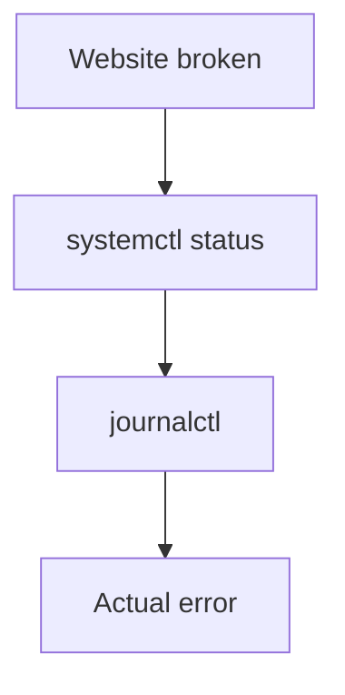

> [!TIP]
> Random restart se pehle status + logs dekho.

---

# 14 — 🌐 Linux Networking Mental Model

Core question:

> **Node app `localhost:3000` pe chal rahi hai, lekin doosre computer se kyun nahi open ho rahi?**

Answer ke liye hume interfaces, IP, bind addresses, ports, firewall aur routing samajhna hoga.

---

# 15 — Network Interface

Network interface = machine ka network connection point.

Examples:

```text
lo
eth0
wlan0
enp1s0
wlp4s0
```

Inspect:

```bash
ip addr
```

or:

```bash
ip a
```

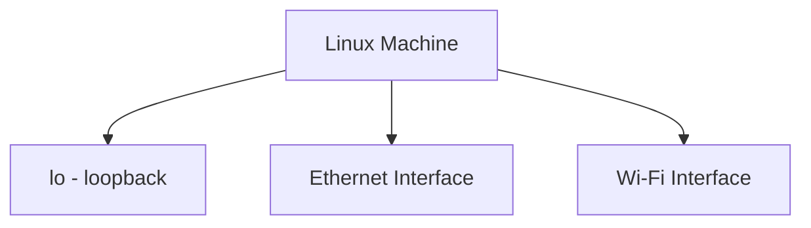

---

# 16 — Private IP vs Public IP

Private IPv4 ranges:

```text
10.0.0.0/8
172.16.0.0/12
192.168.0.0/16
```

Example home network:

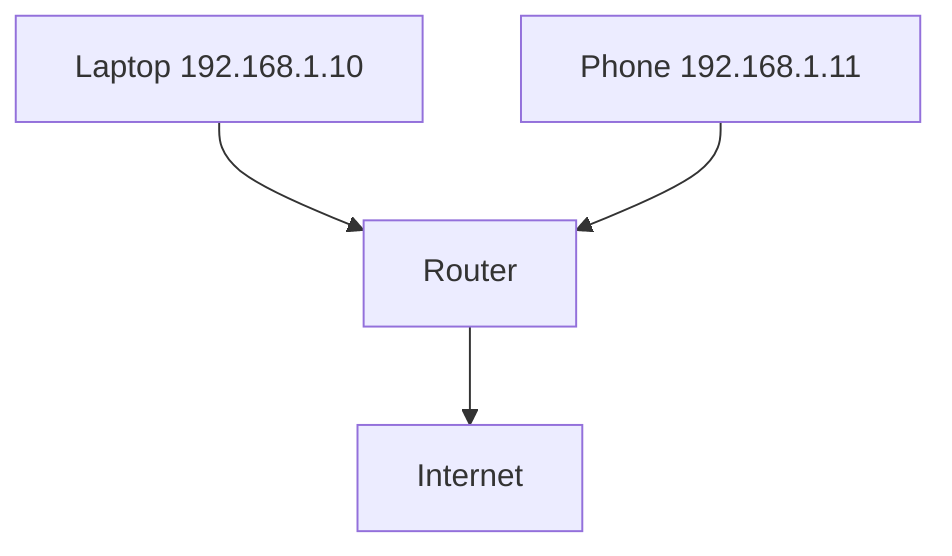

Private IP internet par globally routable address nahi hota.

Public IP internet-facing routing mein use ho sakta hai.

---

# 17 — NAT

Home-style simplified model:

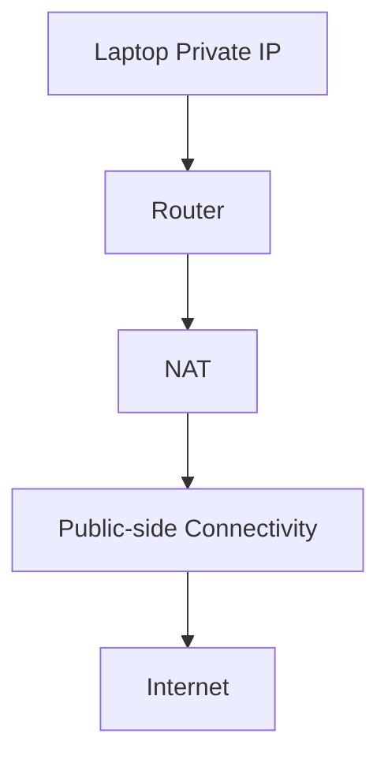

Pareto level:

> NAT private-side hosts aur public-side communication ke beech address/connection translation mein help karta hai.

---

# 18 — Ports

One machine, many network services:

```text
22    SSH
80    HTTP
443   HTTPS
3000  Node app
5432  PostgreSQL
6379  Redis
27017 MongoDB
```

Mental analogy:

```text
IP   ≈ building address
Port ≈ door/service number
```

Analogy perfect nahi hai, but intuition useful hai.

---

# 19 — Socket

Networking ka key mental model:

> **Socket = communication endpoint.**

For our DevOps level, think:

```text
IP + Port + Protocol
```

Example:

```text
127.0.0.1:3000
```

Node process:

```text
create socket
↓
bind address + port
↓
listen
```

---

# 20 — `localhost` / Loopback

```text
localhost
↓
this machine
```

Common addresses:

```text
127.0.0.1
::1
```

Loopback traffic host ke andar hi rehta hai.

---

# 21 — `127.0.0.1` vs `0.0.0.0`

## Bind to `127.0.0.1`

```text
Node
↓
127.0.0.1:3000
```

Meaning:

> Sirf local loopback interface par listen.

Doosri machine directly external interface se reach nahi karegi.

## Bind to `0.0.0.0`

Server bind context mein:

```text
0.0.0.0:3000
```

means roughly:

> all local IPv4 interfaces par listen.

> [!WARNING]
> `0.0.0.0` ka matlab public IP nahi hota.  
> Internet reachability ke liye routing, firewall, cloud rules, public addressing etc. bhi matter karte hain.

---

# 22 — 🔥 Firewall

Firewall rules decide kar sakte hain:

```text
allow
deny
```

based on:

```text
port
protocol
source
destination
```

Ubuntu helper:

```bash
sudo ufw status
```

Example architecture:

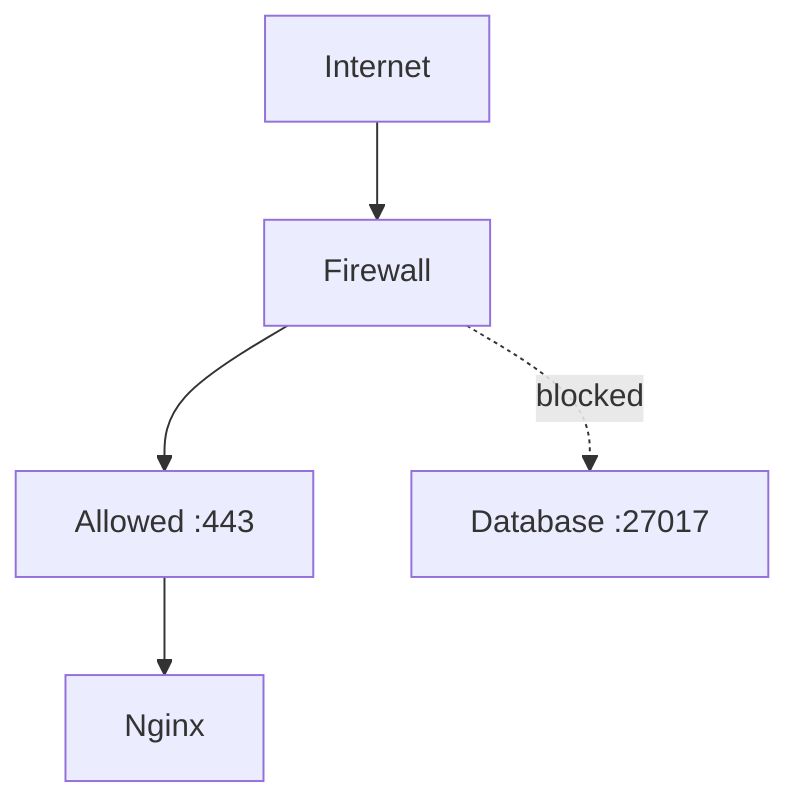

Principle:

> **Least Network Exposure** — jo port public hone ki zarurat nahi, usko public mat karo.

---

# 23 — `ss` — Listening Ports

Useful:

```bash
ss -ltn
```

More detail:

```bash
sudo ss -tulpn
```

You may see:

```text
127.0.0.1:3000
0.0.0.0:22
```

Interpretation:

```text
127.0.0.1:3000
→ local-only IPv4 loopback listener

0.0.0.0:22
→ SSH listening on all local IPv4 interfaces
```

---

# 24 — `curl` — DevOps Stethoscope

Test backend directly:

```bash
curl http://127.0.0.1:3000
```

Test Nginx:

```bash
curl http://localhost
```

Debug:

```text
Backend curl works
+
Nginx URL fails
↓
likely proxy/Nginx layer issue
```

This is why `curl` is incredibly useful.

---

# 25 — `ping`

```bash
ping google.com
```

Uses ICMP echo.

> [!CAUTION]
> Ping failure ≠ website definitely down.  
> ICMP can be blocked while HTTPS works perfectly.

---

# 26 — Routing & Default Gateway

Inspect:

```bash
ip route
```

Typical concept:

```text
destination unknown?
↓
send to default gateway
```

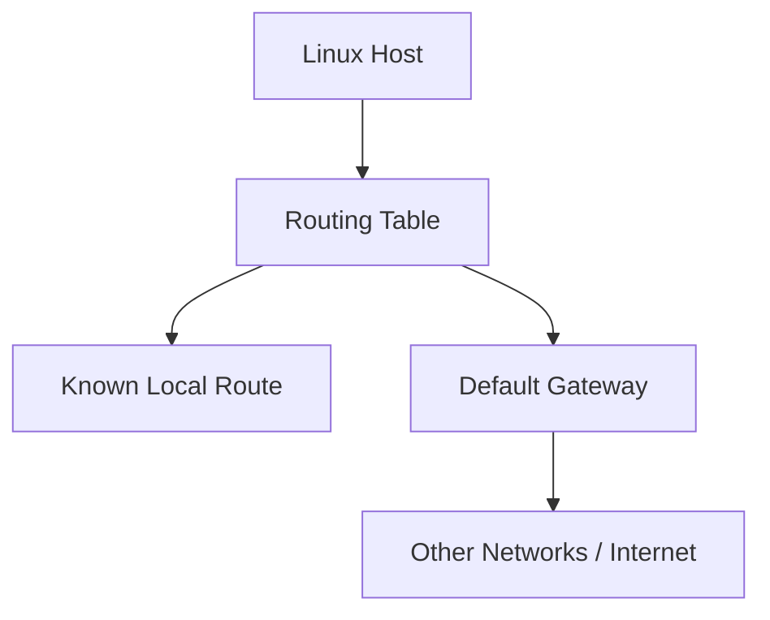

---

# 27 — DNS Tools

```bash
nslookup example.com
```

or:

```bash
dig example.com
```

Mental:

```text
domain
↓
DNS
↓
IP address
```

---

# 28 — 🌍 End-to-End Request Journey

This is Unit 02 ka major master diagram.

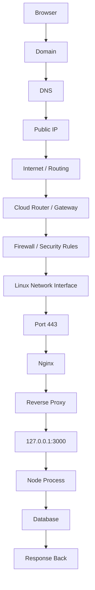

---

# 29 — Networking Debugging Order

Website broken?

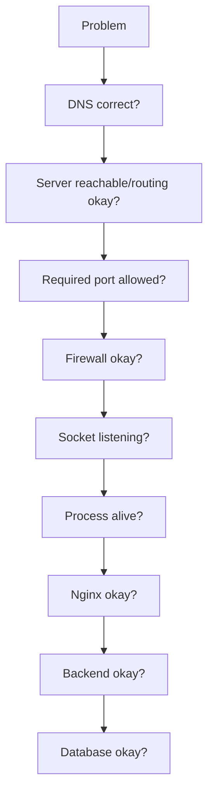

Useful commands:

```text
DNS         → dig / nslookup
Interfaces  → ip addr
Routes      → ip route
Reachability→ ping
Sockets     → ss
HTTP        → curl
Processes   → ps
Services    → systemctl
Logs        → journalctl
```

---

# 30 — 🔐 SSH — Remote Server Access

Remote server = computer elsewhere.

Examples:

```text
AWS EC2
Azure VM
DigitalOcean Droplet
college/office server
Raspberry Pi
```

SSH = **Secure Shell**.

Uses:

```text
remote login
remote command execution
secure file transfer
```

Typical TCP port:

```text
22
```

---

# 31 — SSH Client/Server Model

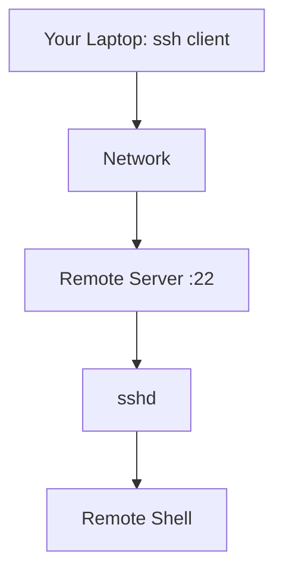

Command:

```bash
ssh ubuntu@203.0.113.10
```

Break:

```text
ubuntu
↓
remote username

203.0.113.10
↓
server IP
```

After login:

```text
ubuntu@server:~$
```

Now commands **remote server par execute** ho rahe hain.

---

# 32 — Password vs SSH Keys

Password auth possible ho sakta hai.

Better common production model:

```text
SSH key pair
```

Contains:

```text
Private Key
Public Key
```

## Private key

```text
stays with client
NEVER share
```

## Public key

Server par authorize ki ja sakti hai.

Common files:

```text
~/.ssh/id_ed25519
~/.ssh/id_ed25519.pub
```

Generate:

```bash
ssh-keygen -t ed25519
```

---

# 33 — SSH Key Authentication — Correct Mental Model

Wrong oversimplification:

```text
server encrypts with public key
client decrypts with private key
```

SSH public-key authentication ko aise memorize mat karo.

Better:

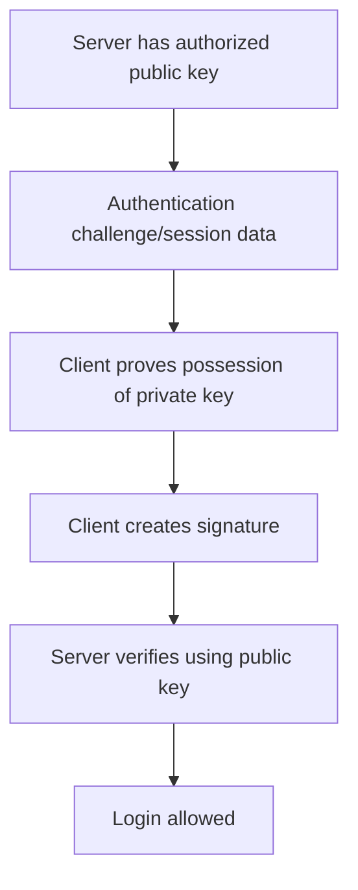

> [!IMPORTANT]
> Private key network par send nahi hoti.

---

# 34 — `authorized_keys`

Remote user ke server account mein commonly:

```text
~/.ssh/authorized_keys
```

Authorized public keys listed hote hain.

Mental:

```text
Your public key
↓
server user's authorized_keys
↓
server recognizes allowed identity
```

---

# 35 — Server Identity & `known_hosts`

SSH mein sirf server tumhe verify nahi karta.

Client ko bhi check karna hota hai:

> "Main correct server se connect kar raha hoon?"

First connection par fingerprint prompt aa sakta hai.

Known server host keys:

```text
~/.ssh/known_hosts
```

Two identity questions:

```text
Server asks:
Who are you?

Client asks:
Are you really my server?
```

---

# 36 — `.pem` Files

`.pem` ek general encoding/container format hai for cryptographic material.

EC2 tutorials mein often private SSH key `.pem` file form mein milti hai.

Example:

```bash
ssh -i ~/keys/aws-demo.pem ubuntu@SERVER_IP
```

Private key permissions:

```bash
chmod 400 aws-demo.pem
```

Intent:

```text
only owner can read
```

> [!CAUTION]
> `.pem` ≠ automatically "SSH key" in every context. PEM format certificates/keys aur other crypto material ke liye bhi use hota hai.

---

# 37 — SSH Troubleshooting Flow

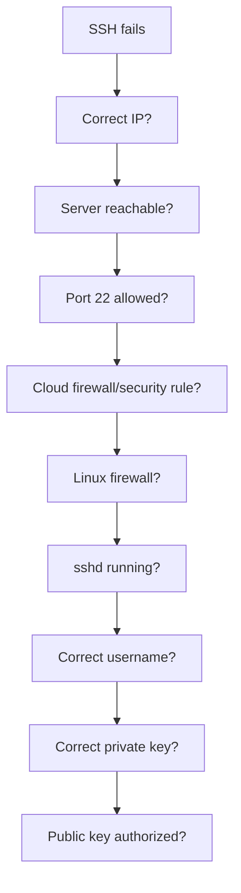

Ubuntu commonly:

```bash
sudo systemctl status ssh
```

Other distros may use service name:

```text
sshd
```

---

# 38 — `scp`

Secure copy over SSH ecosystem.

Local → remote:

```bash
scp app.js ubuntu@SERVER_IP:/home/ubuntu/
```

Remote → local:

```bash
scp ubuntu@SERVER_IP:/home/ubuntu/app.log .
```

Later Git, CI/CD, registries, artifacts etc. manual SCP ko replace/augment karenge.

---

# 39 — SSH Config

Instead of repeatedly:

```bash
ssh -i ~/.ssh/aws.pem ubuntu@203.0.113.10
```

Config:

```text
Host devserver
    HostName 203.0.113.10
    User ubuntu
    IdentityFile ~/.ssh/aws.pem
```

Then:

```bash
ssh devserver
```

---

# 40 — 🚀 Manual Production Deployment

Goal:

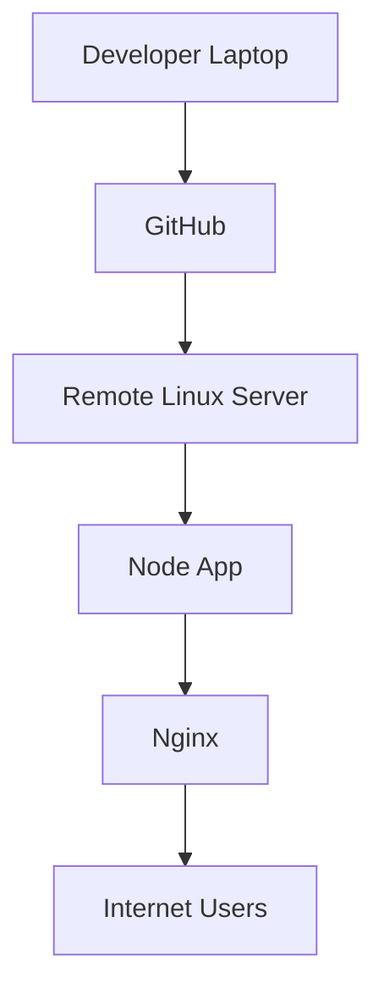

Target public request flow:

```text
User
↓
Domain
↓
Server
↓
Nginx
↓
Node
↓
Database
```

---

# 41 — Step 1: SSH into Server

```bash
ssh ubuntu@SERVER_IP
```

or:

```bash
ssh -i key.pem ubuntu@SERVER_IP
```

After this:

> Every command remote server par execute ho raha hai.

---

# 42 — Step 2: Update Package Metadata

Ubuntu/Debian:

```bash
sudo apt update
```

This refreshes package indexes.

> [!CAUTION]
> `sudo apt upgrade` ko blind mandatory deployment step mat samjho. Production package upgrades controlled/planned hone chahiye because they can change system behavior.

---

# 43 — Step 3: Install Required Software

Example:

```bash
sudo apt install git nginx
```

Node install strategy project version ke according honi chahiye.

Verify:

```bash
node -v
npm -v
git --version
nginx -v
```

> [!IMPORTANT]
> Production mein exact/runtime-compatible Node version strategy define karo. Distro package har time project ke required version se match nahi karega.

---

# 44 — Step 4: Bring Application Code

```bash
git clone REPOSITORY_URL
cd my-app
```

Later updates:

```bash
git pull
```

Manual flow:

```text
Laptop
↓
git push
↓
GitHub
↓
server git pull
```

---

# 45 — Step 5: Install Dependencies

With lockfile:

```bash
npm ci
```

Useful for clean/reproducible install.

Without appropriate lockfile:

```bash
npm install
```

> [!NOTE]
> `npm ci` requires lockfile and package metadata consistency.

---

# 46 — Step 6: Environment Variables

Typical:

```text
DATABASE_URL
JWT_SECRET
PORT
API_KEY
NODE_ENV
```

Principle:

```text
Code
↓
same artifact

Configuration
↓
environment-specific
```

> [!WARNING]
> `.env` automatically har Node app load nahi karta. App/framework/tool ko env loading support/configuration chahiye, or Node runtime features explicitly use karne honge.

Secrets:

```text
❌ GitHub mein commit mat karo
```

---

# 47 — Step 7: Manually Test Application

```bash
node server.js
```

Then:

```bash
curl http://127.0.0.1:3000
```

If curl works:

```text
Node process
✅
local HTTP listener
✅
```

But manual foreground process production solution nahi hai.

---

# 48 — Step 8: systemd Service

Production service example:

```ini
[Unit]
Description=My Node API
After=network.target

[Service]
User=ubuntu
WorkingDirectory=/home/ubuntu/my-app
ExecStart=/usr/bin/node server.js
Restart=on-failure
Environment=NODE_ENV=production
# Optional:
# EnvironmentFile=/home/ubuntu/my-app/.env

[Install]
WantedBy=multi-user.target
```

> [!IMPORTANT]
> `ExecStart` ka Node path actual machine se verify karo:

```bash
which node
```

If Node was installed through a user-scoped version manager, path/systemd environment different ho sakta hai.

Commands:

```bash
sudo systemctl daemon-reload
sudo systemctl start myapp
sudo systemctl enable myapp
sudo systemctl status myapp
```

Logs:

```bash
sudo journalctl -u myapp
sudo journalctl -u myapp -f
```

---

# 49 — Bind App to Loopback

Same-host Nginx frontend proxy hai?

Node:

```text
127.0.0.1:3000
```

can be a good architecture.

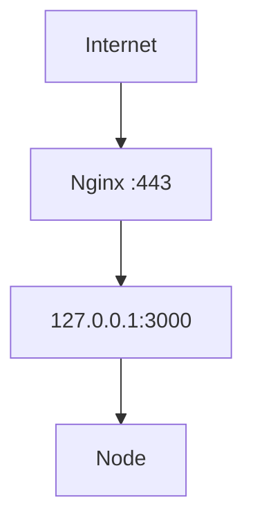

Node ko unnecessary public interface par expose karna required nahi.

---

# 50 — Step 9: Nginx Reverse Proxy

Example:

```nginx
server {
    listen 80;
    server_name example.com;

    location / {
        proxy_pass http://127.0.0.1:3000;
    }
}
```

Before reload:

```bash
sudo nginx -t
```

If valid:

```bash
sudo systemctl reload nginx
```

> [!TIP]
> Configuration change par successful validation ke baad `reload` often preferable hai because it avoids unnecessary full restart.

Ubuntu/Debian commonly:

```text
/etc/nginx/sites-available/
/etc/nginx/sites-enabled/
```

but this convention universal Linux rule nahi hai.

---

# 51 — Step 10: Firewall

If using UFW:

```bash
sudo ufw status
```

Before enabling firewall on remote server, **SSH access allow karna critical hai**:

```bash
sudo ufw allow OpenSSH
```

Web traffic:

```bash
sudo ufw allow 'Nginx Full'
```

Then enable if appropriate:

```bash
sudo ufw enable
```

> [!DANGER]
> Remote server par firewall enable karke SSH block kar diya toh tum khud ko lock out kar sakte ho.

---

# 52 — Cloud Firewall vs Linux Firewall

Two different layers ho sakte hain:

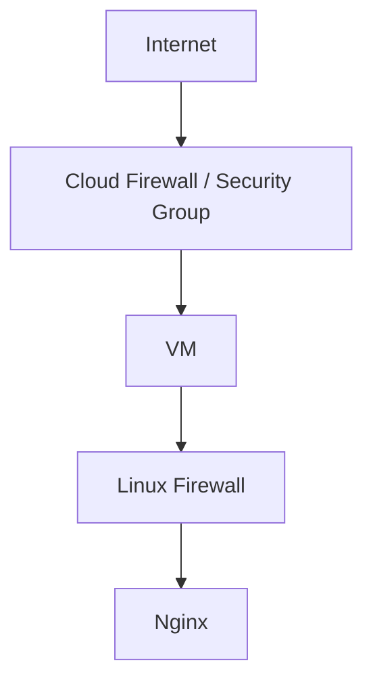

Both can affect reachability.

Example:

```text
Cloud allows 443
+
Linux blocks 443
=
request still fails
```

---

# 53 — DNS

Domain:

```text
example.com
```

DNS record:

```text
A record
↓
server public IPv4
```

Then:

```text
example.com
↓
DNS
↓
SERVER_IP
```

---

# 54 — HTTPS/TLS

Conceptual:

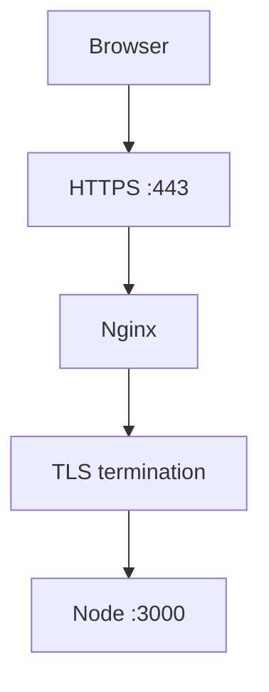

Exact certificate automation commands later cloud/deployment context ke according cover karna better hai.

---

# 55 — Nginx Logs

Common Ubuntu paths:

```text
/var/log/nginx/access.log
/var/log/nginx/error.log
```

Live:

```bash
sudo tail -f /var/log/nginx/error.log
```

---

# 56 — Production Debug Flow

```mermaid
flowchart TB
    A[Website broken] --> B[DNS]
    B --> C[Server reachable]
    C --> D[80/443 allowed]
    D --> E[Nginx running]
    E --> F[Nginx config valid]
    F --> G[Node service running]
    G --> H[Node listening on 3000]
    H --> I[Node logs]
    I --> J[Database]
```

Commands:

```text
dig / nslookup
curl
ss
systemctl
journalctl
nginx -t
tail -f
```

---

# 57 — Manual Update Lifecycle

```text
Developer
↓
git commit
↓
git push
↓
SSH to server
↓
git pull
↓
npm ci / install if required
↓
restart/reload service
↓
verify
```

This works.

But pain starts:

```text
Which Node version?
Which system libraries?
Did npm install exactly match?
Did someone manually change server?
Did we restart?
What if 10 servers?
What if staging differs?
```

That pain naturally motivates Docker.

---

# 58 — Why Docker Comes Next

Manual server:

```text
Linux
↓
install runtime
↓
install dependencies
↓
configure app
↓
run process
```

Docker idea:

```text
Application
+
runtime/userspace dependencies
+
startup instructions
↓
repeatable image
```

Core transition:

> **From "configure every server manually" → "build a repeatable application artifact."**

---

# 🔑 Unit 02 Keyword Sheet

```text
Kernel          → OS core managing hardware/resources
Distribution    → Linux kernel + tools/ecosystem
Shell           → command interpreter
Terminal        → interface/window to shell
/               → filesystem root
/home           → user homes
/etc            → configuration
/var/log        → logs
sudo            → controlled privilege elevation
chmod           → change permissions
chown           → change ownership
PID             → process ID
systemd         → service manager/init system
systemctl       → control services
journalctl      → systemd journal logs
interface       → network connection endpoint on host
private IP      → private network address
public IP       → globally routable internet address
NAT             → address/connection translation mechanism
port            → network service endpoint number
socket          → communication endpoint
localhost       → current host
127.0.0.1       → IPv4 loopback
0.0.0.0 bind    → all local IPv4 interfaces
firewall        → traffic allow/deny rules
ss              → socket inspection
curl            → HTTP/client testing
ip route        → routing table
DNS             → names → addresses
SSH             → secure remote shell/access
sshd            → SSH server daemon
authorized_keys → allowed SSH public keys
known_hosts     → remembered server host identities
scp             → secure copy over SSH
Nginx           → web server/reverse proxy
reverse proxy   → public frontend forwards to backend
```

---

# 🧠 Active Recall — Short Answers

**Q1. Linux technically kya hai?**  
Linux kernel hai.

**Q2. Ubuntu kya hai?**  
Linux distribution.

**Q3. Shell kya karta hai?**  
Commands interpret/execute karta hai.

**Q4. `/` kya hai?**  
Linux filesystem root.

**Q5. `/etc`?**  
System/application configuration.

**Q6. `/var/log`?**  
Logs ka common location.

**Q7. Absolute path?**  
Root `/` se complete path.

**Q8. `pwd`?**  
Current working directory print karta hai.

**Q9. `ls -la`?**  
Detailed listing including hidden files.

**Q10. `tail -f`?**  
File/log ke appended output ko live follow karta hai.

**Q11. `|` pipe?**  
Previous command output ko next command input banata hai.

**Q12. `>` vs `>>`?**  
Overwrite vs append.

**Q13. `root`?**  
Linux superuser.

**Q14. `sudo`?**  
Authorized command ko elevated privileges se execute karta hai.

**Q15. `chmod`?**  
Permissions change.

**Q16. `chown`?**  
Ownership change.

**Q17. `755`?**  
Owner rwx, group r-x, others r-x.

**Q18. Process?**  
Running program instance.

**Q19. PID?**  
Process ID.

**Q20. systemd?**  
Common Linux service manager/init system.

**Q21. `systemctl status nginx`?**  
Nginx service status.

**Q22. `journalctl -u nginx -f`?**  
Nginx service logs live follow.

**Q23. Network interface?**  
Machine ka network connection endpoint/interface.

**Q24. Private IP?**  
Private network address, globally internet-routable nahi.

**Q25. Public IP?**  
Globally routable internet address.

**Q26. NAT ka Pareto role?**  
Private/public-side networking translation mein help.

**Q27. Port?**  
Machine par network service endpoint number.

**Q28. Socket?**  
Communication endpoint.

**Q29. `localhost`?**  
Current machine.

**Q30. `127.0.0.1:3000` listener?**  
IPv4 loopback-only port 3000 listener.

**Q31. `0.0.0.0:3000` bind?**  
All local IPv4 interfaces par listener.

**Q32. `0.0.0.0` public IP hai?**  
No.

**Q33. `ss -ltn`?**  
Listening TCP sockets inspect karta hai.

**Q34. `curl`?**  
HTTP/service request test tool.

**Q35. Ping fail = site down?**  
No.

**Q36. `ip route`?**  
Routing table/default gateway inspect.

**Q37. `dig` / `nslookup`?**  
DNS lookup tools.

**Q38. SSH?**  
Secure remote shell/access protocol.

**Q39. Typical SSH port?**  
TCP 22.

**Q40. SSH private key share karni chahiye?**  
Never.

**Q41. SSH public-key auth mein private key server ko send hoti hai?**  
No.

**Q42. `authorized_keys`?**  
Server user ke allowed public keys.

**Q43. `known_hosts`?**  
Client-side remembered server identities.

**Q44. `.pem` always SSH-only format hai?**  
No.

**Q45. `scp`?**  
Secure file copy.

**Q46. Manual production architecture?**  
Internet → Nginx → Node → DB.

**Q47. Node ko same-host Nginx ke peeche `127.0.0.1` par bind kyun kar sakte ho?**  
Backend ko unnecessary public exposure se bachane ke liye.

**Q48. `nginx -t`?**  
Nginx config syntax/validity test.

**Q49. UFW enable se pehle remote server par kya ensure karo?**  
SSH allowed ho.

**Q50. Manual deployment ka biggest scaling pain?**  
Environment/configuration drift and repeated setup.

---

# ⚡ 2-Minute Revision

```text
LINUX
Kernel → distro → shell → filesystem

FILES
/ → /home → /etc → /var/log

COMMANDS
pwd, ls, cd, cp, mv, rm, cat, less, tail, grep

PERMISSIONS
user/group/others
rwx
chmod = permissions
chown = ownership

PROCESSES
program → process → PID
ps / top

SERVICES
systemd
systemctl
journalctl

NETWORK
interface → IP → route → port → socket

LOCALHOST
127.0.0.1 = this host only
0.0.0.0 bind = all local IPv4 interfaces

DEBUG
ip addr
ip route
ss
curl
dig
systemctl
journalctl

SSH
client → TCP 22 → sshd → auth → remote shell
private key stays private
public key authorized on server

DEPLOYMENT
GitHub → SSH → Linux → dependencies → systemd
→ Node :3000 → Nginx :443 → users

NEXT PROBLEM
Manual setup repeats and drifts
↓
Docker
```

---

# ✅ Coverage Checklist

- [x] Linux kernel vs distribution
- [x] Shell vs terminal
- [x] Filesystem root and important directories
- [x] Paths
- [x] Core file commands
- [x] Pipes/redirection/chaining
- [x] Users/groups/root/sudo
- [x] Permissions and ownership
- [x] Processes and PIDs
- [x] systemd/services
- [x] journal logs
- [x] Network interfaces
- [x] Private/public IP
- [x] NAT
- [x] Ports and sockets
- [x] localhost / 127.0.0.1 / 0.0.0.0
- [x] Firewall
- [x] `ss`, `curl`, `ping`, `ip route`, DNS tools
- [x] End-to-end request flow
- [x] SSH architecture
- [x] SSH keys / authorized_keys / known_hosts
- [x] `.pem`
- [x] SCP and SSH config
- [x] Manual production deployment
- [x] systemd production service
- [x] Nginx reverse proxy
- [x] UFW/cloud firewall layers
- [x] DNS/TLS mental model
- [x] Logs/debugging
- [x] Manual update lifecycle
- [x] Why Docker is the next step

---

# 🏁 Unit 02 Complete

```text
🐧 Linux + Networking
██████████ 100% ✅

Next:
🐳 Docker
```
