# 🐳 DevOps From First Principles — Unit 03 Complete Notes
> **Docker From First Principles — Containers, Images, Dockerfile, Storage, Networking, Compose & Production Deployment**  
> Designed for Obsidian + GitHub. Visuals use Mermaid so the notes remain self-contained.

---

# 🗺️ Unit Map

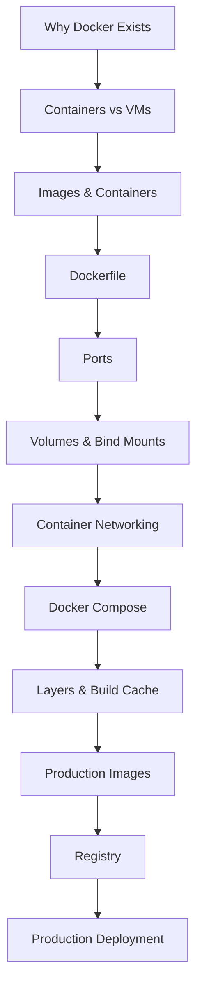

> [!IMPORTANT]
> ## 🔵 Unit 03 Core Idea
> Docker ka main value command syntax nahi hai.  
> **Docker application + required userspace/runtime setup ko repeatable image artifact mein package karta hai, jisse same image ko different environments mein consistently run kiya ja sake.**

---

# 01 — 😭 Why Docker Exists

Classic problem:

```text
Developer Laptop
↓
Node 22
↓
dependencies
↓
configuration
↓
app works ✅
```

Server:

```text
Ubuntu
↓
Node 18
↓
missing/system differences
↓
different dependencies
↓
app fails 💥
```

"Works on my machine."

Problem sirf source code nahi hai.

Application often depends on:

```text
runtime
dependencies
system libraries
filesystem
environment configuration
startup command
```

Goal:

> **Application environment reproducible banao.**

---

# 02 — 📦 Container Mental Model

Pareto definition:

> **Container = isolated running environment/process context for an application.**

Conceptual:

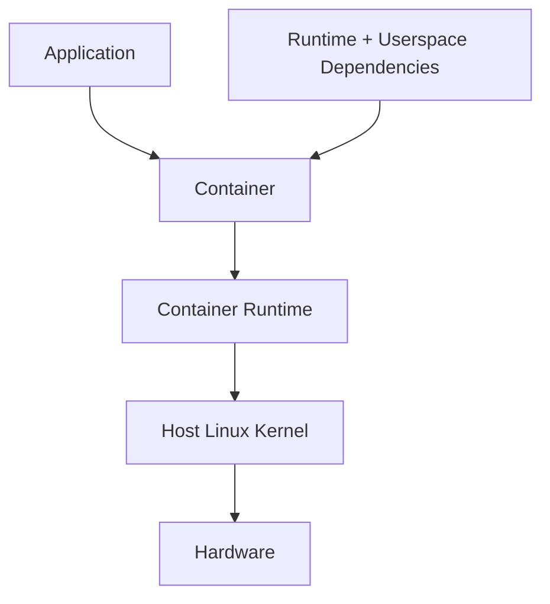

Container generally full guest OS kernel carry nahi karta.

---

# 03 — 🖥️ Containers vs Virtual Machines

## Virtual Machine

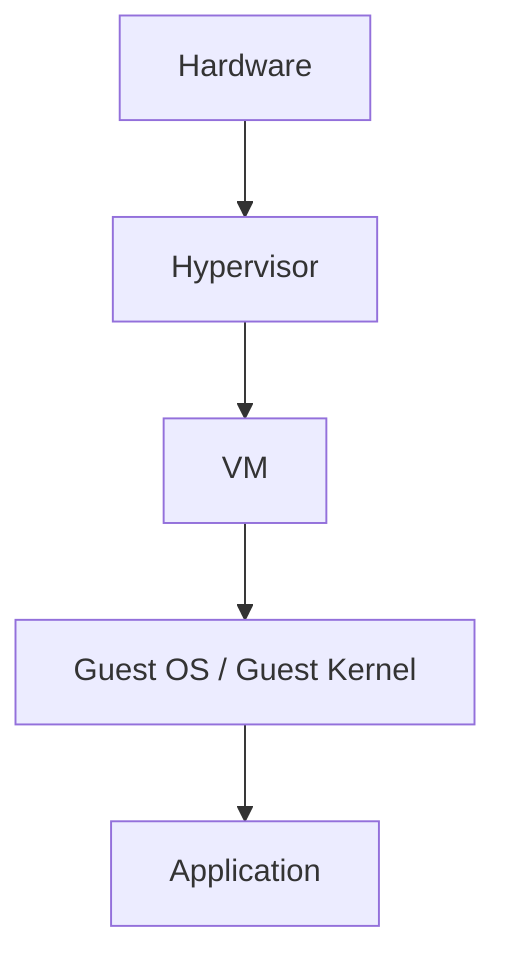

## Container

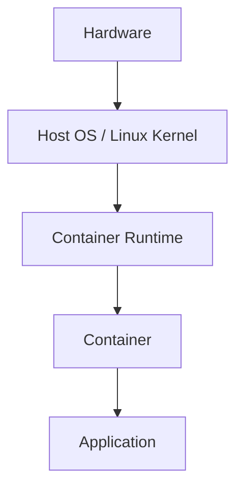

### Mental shortcut

```text
VM
≈ virtual computer with guest OS/kernel

Container
≈ isolated application process environment sharing host kernel
```

> [!CAUTION]
> Container security/isolation VM ke exactly equivalent nahi. Shared kernel means different threat model.

---

# 04 — 🪟 Docker on Windows

Linux containers need a Linux kernel.

On Windows with Docker Desktop, Linux containers commonly run through a Linux environment/VM underneath.

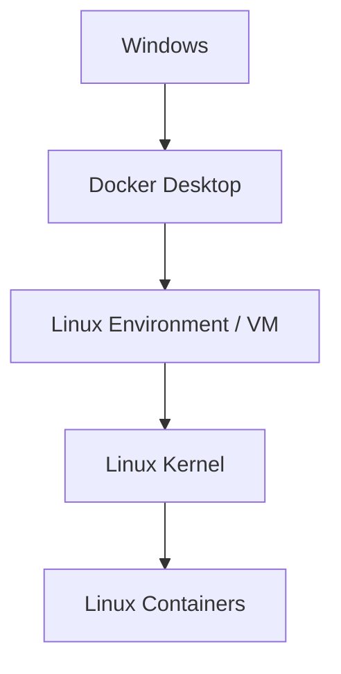

So:

```bash
docker run nginx
```

ka matlab Nginx magically native Windows process nahi ban gaya.

---

# 05 — 🧱 Isolation Internals — Pareto

Two Linux concepts:

```text
Namespaces
+
cgroups
```

## Namespaces

Rough question:

> Container kya dekh sakta hai?

Isolation around things like:

```text
processes
network
mounts
hostname
users
```

## cgroups

Rough question:

> Container kitne resources use kar sakta hai?

```text
CPU
memory
```

Mental:

```text
namespaces → isolation/view
cgroups    → resource accounting/limits
```

---

# 06 — 🖼️ Image vs Container

Most important Docker distinction.

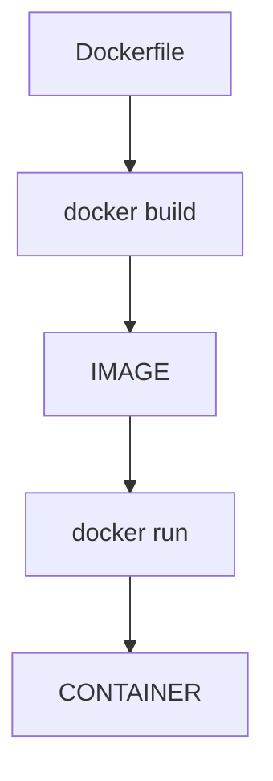

## Image

> Read-only-ish packaged template/artifact used to create containers.

Contains:

```text
filesystem layers
runtime/userspace files
application files
metadata
startup configuration
```

## Container

> Runtime instance created from an image.

Mental analogies:

```text
Class → Object
Recipe → Dish
Image → Container
```

One image → many containers.

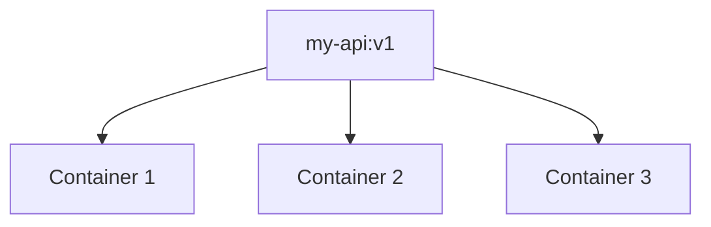

---

# 07 — Dockerfile

Dockerfile = image build instructions.

Node example:

```dockerfile
FROM node:22

WORKDIR /app

COPY package*.json ./

RUN npm ci

COPY . .

EXPOSE 3000

CMD ["node", "server.js"]
```

Don't memorize blindly. Understand each instruction.

---

# 08 — `FROM`

```dockerfile
FROM node:22
```

Meaning:

> Existing Node base image se start.

```text
base image
↓
Node runtime/userspace
↓
add our app
```

> [!TIP]
> Real project mein Node version project requirements ke according pin/select karo.

---

# 09 — `WORKDIR`

```dockerfile
WORKDIR /app
```

Following commands ka working directory:

```text
/app
```

Linux filesystem knowledge directly reuse ho rahi hai.

---

# 10 — `COPY`

```dockerfile
COPY package*.json ./
```

Build context se files image filesystem mein copy.

Later:

```dockerfile
COPY . .
```

Remaining relevant project content copy.

---

# 11 — `RUN`

```dockerfile
RUN npm ci
```

Executes at **image build time**.

```text
docker build
↓
RUN npm ci
↓
dependencies image mein install
```

---

# 12 — `CMD`

```dockerfile
CMD ["node", "server.js"]
```

Default command when container starts.

```text
docker run
↓
container starts
↓
CMD
↓
node server.js
```

### Lock

```text
RUN → build time
CMD → container startup/runtime
```

---

# 13 — `EXPOSE`

```dockerfile
EXPOSE 3000
```

Documents/intends container port.

> [!WARNING]
> `EXPOSE 3000` host par port publish nahi karta.

Publishing separate:

```bash
docker run -p 8080:3000 my-api
```

---

# 14 — Build Image

```bash
docker build -t my-api:1.0 .
```

Break:

```text
docker build
↓
build image

-t
↓
tag/name

.
↓
current directory build context
```

List:

```bash
docker images
```

---

# 15 — Run Container

```bash
docker run my-api:1.0
```

Mental:

```text
Image
↓
create container
↓
start container
↓
CMD
↓
application process
```

Detached:

```bash
docker run -d my-api:1.0
```

---

# 16 — Docker Client/Daemon Mental Model

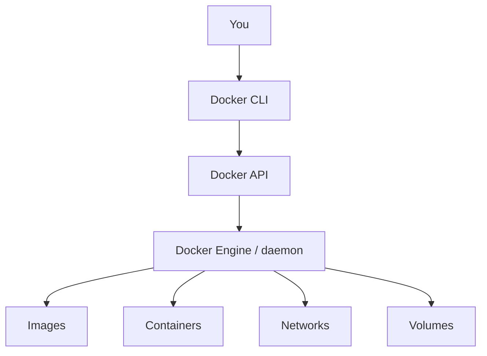

Pareto:

```text
docker command → CLI
dockerd/engine → manages Docker objects
```

Deep runtime internals can wait.

---

# 17 — Registry

Registry stores/distributes images.

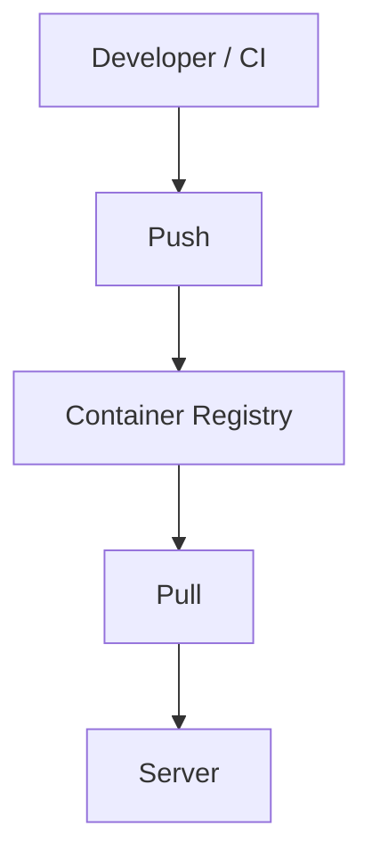

Examples:

```text
Docker Hub
GitHub Container Registry
Amazon ECR
Google Artifact Registry
Azure Container Registry
```

## GitHub vs Registry

```text
GitHub / Git repo
↓
source code

Container Registry
↓
built images
```

---

# 18 — 🚪 Port Mapping

Command:

```bash
docker run -p 8080:3000 my-api
```

Meaning:

```text
HOST PORT 8080
↓
CONTAINER PORT 3000
```

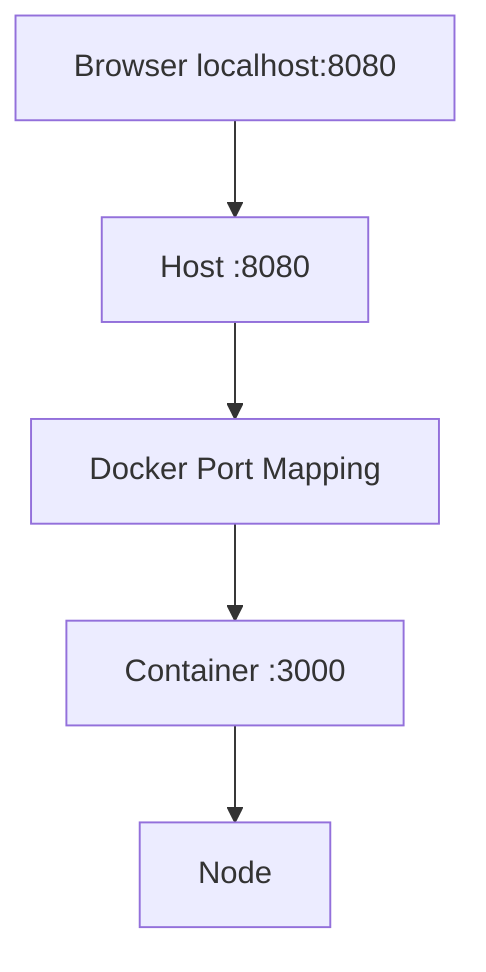

Host/container ports same hona required nahi.

Examples:

```text
3000:3000
9000:3000
8080:3000
```

---

# 19 — Multiple Containers Same Internal Port

Possible:

```text
Host :3001
↓
Container A :3000
```

and:

```text
Host :3002
↓
Container B :3000
```

Why?

Containers have separate network namespaces.

---

# 20 — Container App Bind Address

Important Node-in-container rule:

If app inside container only binds:

```text
127.0.0.1:3000
```

then it may only listen on container's own loopback.

For normal published-port access, app often needs:

```text
0.0.0.0:3000
```

inside container.

Mental:

```text
host port
↓
container network interface
↓
app must listen there
```

> [!IMPORTANT]
> `0.0.0.0` here means all local IPv4 interfaces **inside that network namespace**. It does not mean "public internet."

---

# 21 — Container Lifecycle Commands

Running:

```bash
docker ps
```

All including stopped:

```bash
docker ps -a
```

Logs:

```bash
docker logs CONTAINER
docker logs -f CONTAINER
```

Shell:

```bash
docker exec -it CONTAINER sh
```

Stop:

```bash
docker stop CONTAINER
```

Start again:

```bash
docker start CONTAINER
```

Remove:

```bash
docker rm CONTAINER
```

Remove image:

```bash
docker rmi IMAGE
```

> [!CAUTION]
> Container remove ≠ image remove.

---

# 22 — 💀 Writable Layer & Ephemeral Containers

Container changes its own writable layer.

```text
Image read-only layers
↓
Container writable layer
↓
new/changed files
```

Container removed:

```text
container writable layer
↓
removed
```

Important data ko sirf disposable writable layer mein mat rakho.

---

# 23 — 💾 Docker Volumes

Volume = Docker-managed persistent storage whose lifecycle can outlive a container.

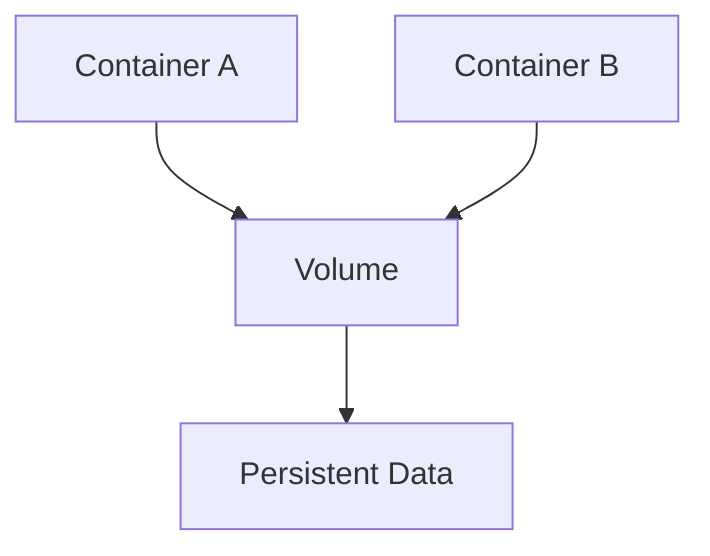

Create:

```bash
docker volume create mongo-data
```

List:

```bash
docker volume ls
```

Use:

```bash
docker run -d \
  --name mongo \
  -v mongo-data:/data/db \
  mongo:8
```

Break:

```text
mongo-data
↓
volume name

/data/db
↓
container path
```

Container A removed; volume can remain; Container B can mount same volume.

---

# 24 — Bind Mounts

Bind mount maps a specific host path into container.

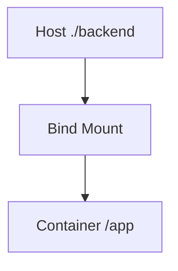

Useful for:

```text
development source code
configuration
specific host files
```

Example:

```bash
docker run -v "$(pwd):/app" ...
```

Syntax shell/OS ke according differ kar sakta hai.

---

# 25 — Volume vs Bind Mount

```text
VOLUME
Docker-managed storage
good for persistent container-generated data

BIND MOUNT
host path → container path
good for source/config sharing
```

---

# 26 — Node `node_modules` Bind-Mount Problem

Image:

```text
/app
├─ server.js
└─ node_modules/
```

Then host folder mounted over:

```text
/app
```

Mounted content image ke existing `/app` content ko obscure kar sakta hai.

Windows host:

```text
Windows node_modules
```

Linux container:

```text
Linux runtime
```

Native dependencies platform-specific ho sakte hain.

Common dev goal:

```text
source code
↓
bind mount

node_modules
↓
container-managed
```

---

# 27 — 🌐 Docker Networking

Multiple containers:

```text
Node container
Mongo container
Redis container
Nginx container
```

Need communication.

Create user-defined network:

```bash
docker network create app-network
```

Concept:

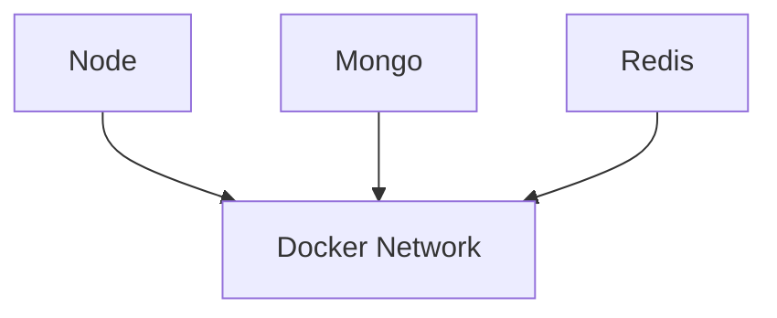

---

# 28 — `localhost` Inside a Container

Crucial:

> **Inside Container A, `localhost` means Container A.**

```text
Backend Container
↓
localhost
↓
Backend Container itself
```

So backend trying:

```text
mongodb://localhost:27017
```

won't reach separate Mongo container.

---

# 29 — Container/Service DNS

Same user-defined network par containers can communicate by names/aliases.

Example Mongo container/service name:

```text
mongo
```

Backend:

```text
mongodb://mongo:27017
```

Flow:

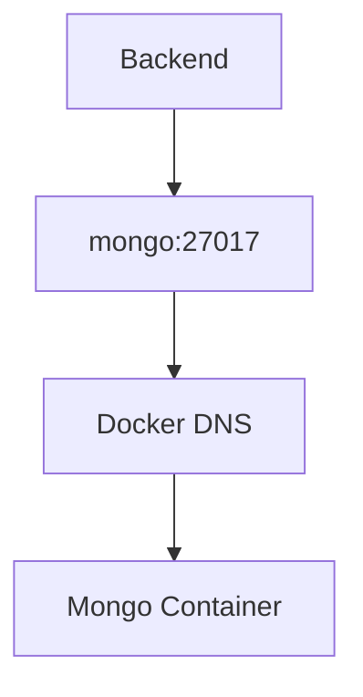

Better than hardcoded container IPs, because container recreation can change addresses.

---

# 30 — Host→Container vs Container→Container

## Host → Container

```text
Browser
↓
localhost:8080
↓
-p 8080:3000
↓
Container :3000
```

## Container → Container

```text
Backend
↓
mongo:27017
↓
Docker Network
↓
Mongo
```

Internal container communication does **not** inherently require publishing DB port to host.

Security benefit:

```text
Public
↓
Nginx / frontend entry point

Internal
↓
API
↓
DB
```

---

# 31 — 🎼 Docker Compose

Problem without Compose:

```text
create network
create volume
run mongo
run backend
run frontend
set env
map ports
remember all flags
```

Compose:

```text
compose.yaml
↓
describe entire stack
↓
docker compose up
```

---

# 32 — Basic Compose Example

```yaml
services:

  mongo:
    image: mongo:8
    volumes:
      - mongo-data:/data/db

  backend:
    build: ./backend
    ports:
      - "3000:3000"
    environment:
      MONGO_URI: mongodb://mongo:27017/mydb
    depends_on:
      - mongo

  frontend:
    build: ./frontend
    ports:
      - "8080:80"
    depends_on:
      - backend

volumes:
  mongo-data:
```

---

# 33 — Compose `services`

```yaml
services:
```

Application components.

```text
mongo
backend
frontend
```

Service definition includes:

```text
image/build
ports
environment
volumes
networks
dependencies
```

---

# 34 — Compose `image:` vs `build:`

```yaml
mongo:
  image: mongo:8
```

Meaning:

```text
existing image use karo
```

Backend:

```yaml
backend:
  build: ./backend
```

Meaning:

```text
source/Dockerfile se image build karo
```

Memory:

```text
image → lao
build → banao
```

---

# 35 — Compose Ports

```yaml
ports:
  - "8080:80"
```

Same as:

```bash
docker run -p 8080:80 ...
```

```text
host :8080
↓
container :80
```

---

# 36 — Compose Volumes

```yaml
volumes:
  - mongo-data:/data/db
```

Bottom:

```yaml
volumes:
  mongo-data:
```

Architecture:

```text
Mongo Container
↓
/data/db
↓
mongo-data volume
```

---

# 37 — Compose Default Network & Service Names

Basic Compose app normally gets a default network.

Backend:

```text
mongo:27017
```

can resolve `mongo` via Compose/Docker network DNS.

> [!IMPORTANT]
> Browser on your host is **not** inside Docker internal DNS.

Browser generally cannot assume:

```text
http://backend:3000
```

works.

Host perspective:

```text
localhost:3000
```

or production:

```text
https://example.com/api
```

---

# 38 — Three Network Perspectives

## Host

```text
Browser
↓
localhost:8080
```

## Container

```text
Backend
↓
mongo:27017
```

## Internet

```text
User
↓
api.example.com
```

Same system, different network namespaces/DNS contexts.

---

# 39 — Compose `environment`

```yaml
environment:
  NODE_ENV: production
  PORT: 3000
```

Node:

```javascript
process.env.NODE_ENV
process.env.PORT
```

Secrets hardcode mat karo.

Bad:

```yaml
DB_PASSWORD: supersecret
```

Better conceptual pattern:

```yaml
DB_PASSWORD: ${DB_PASSWORD}
```

Real production secret management environment/platform ke according.

---

# 40 — `depends_on` & Readiness

```yaml
depends_on:
  - mongo
```

Startup dependency/order describe karta hai.

But:

```text
Container started
≠
database ready
```

Use:

```text
healthchecks
retry logic
readiness-aware startup
```

---

# 41 — Healthcheck Mental Model

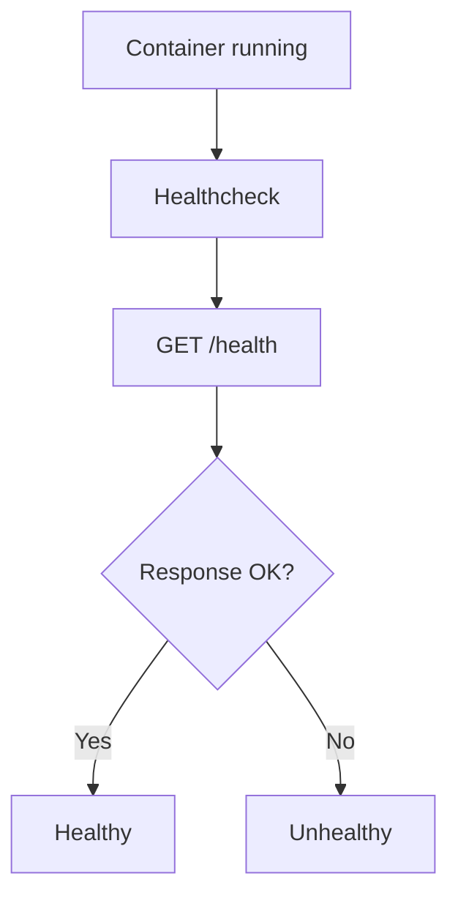

Important:

```text
Running ≠ Ready ≠ Healthy
```

This concept later Kubernetes mein even more important hoga.

---

# 42 — Compose Commands

Start foreground:

```bash
docker compose up
```

Background:

```bash
docker compose up -d
```

Build + start:

```bash
docker compose up --build
```

Status:

```bash
docker compose ps
```

Logs:

```bash
docker compose logs backend
docker compose logs -f backend
```

Stop:

```bash
docker compose stop
```

Tear down:

```bash
docker compose down
```

Danger:

```bash
docker compose down -v
```

> [!DANGER]
> `-v` named volumes remove kar sakta hai. Database data ho toh blindly mat use karo.

---

# 43 — Development Bind Mounts with Compose

```yaml
backend:
  build: ./backend
  volumes:
    - ./backend:/app
```

Flow:

```text
VS Code
↓
host source
↓
bind mount
↓
container /app
```

Useful for fast dev iterations.

Production goal different:

```text
source
↓
build image
↓
deploy tested artifact
```

---

# 44 — Dockerfile vs Image vs Container vs Compose

```text
Dockerfile
↓
HOW TO BUILD AN IMAGE

Image
↓
PACKAGED ARTIFACT/TEMPLATE

Container
↓
RUNNING INSTANCE

Compose
↓
HOW MULTIPLE SERVICES RUN TOGETHER
```

Master visual:

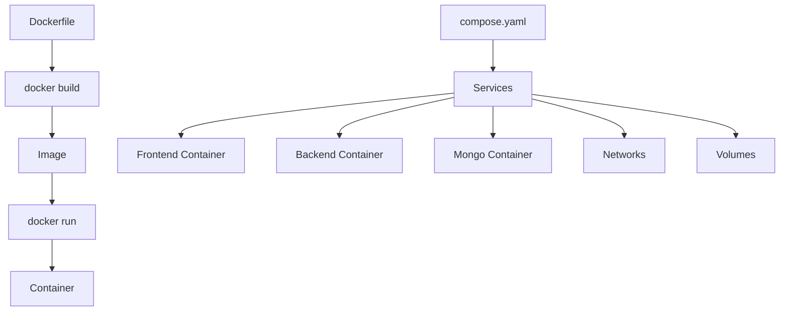

---

# 45 — 🧱 Production Images: Layers

Docker image layers:

```text
Base filesystem/runtime
↓
dependencies
↓
application source
↓
metadata
```

Filesystem-changing build steps can create reusable immutable layers.

Why useful:

```text
cache
reuse
transfer efficiency
storage efficiency
```

---

# 46 — Build Cache

Good Dockerfile:

```dockerfile
FROM node:22

WORKDIR /app

COPY package.json package-lock.json ./

RUN npm ci

COPY . .

CMD ["node", "server.js"]
```

Only source changes:

```text
FROM            → cache
WORKDIR         → cache
COPY package    → cache
RUN npm ci      → cache
COPY source     → rebuild
```

Bad ordering:

```dockerfile
COPY . .
RUN npm ci
```

Any source change can invalidate expensive dependency-install step.

Rule:

> **Less-changing expensive steps earlier; frequently changing source later.**

---

# 47 — `.dockerignore`

Example:

```text
node_modules
.git
.env
npm-debug.log
coverage
```

Purpose:

```text
project
↓
.dockerignore
↓
cleaner/smaller build context
↓
Docker build
```

## `.gitignore` vs `.dockerignore`

```text
.gitignore
↓
Git tracking exclusions

.dockerignore
↓
Docker build-context exclusions
```

`.env` often both mein exclude karna useful.

---

# 48 — `npm ci`

With lockfile:

```bash
npm ci
```

Goal:

```text
clean
lockfile-driven
reproducible dependency install
```

Useful for:

```text
CI
image builds
deployment
```

Requires package-lock/package metadata consistency.

---

# 49 — Base Image Choice

Examples:

```dockerfile
FROM node:22
FROM node:22-slim
FROM node:22-alpine
```

Concept:

```text
fuller image
↓
more included tooling/libraries

slim
↓
reduced Debian-based environment

alpine
↓
very compact Alpine/musl environment
```

> [!CAUTION]
> Alpine always best nahi. Native dependencies/musl compatibility issues ho sakte hain.

Goal:

> **small + compatible + secure + maintainable**

---

# 50 — 🏗️ Multi-Stage Builds

Build stage may need:

```text
source
compiler
devDependencies
build tools
```

Runtime may need only:

```text
Node runtime
production dependencies
built output
```

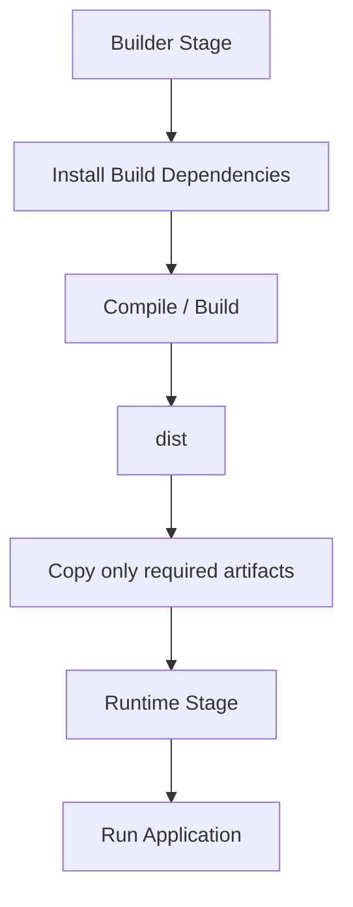

Example:

```dockerfile
FROM node:22 AS builder

WORKDIR /app

COPY package*.json ./
RUN npm ci

COPY . .
RUN npm run build


FROM node:22-slim AS runtime

WORKDIR /app

COPY package*.json ./
RUN npm ci --omit=dev

COPY --from=builder /app/dist ./dist

CMD ["node", "dist/server.js"]
```

Benefits:

```text
smaller image
cleaner runtime
less unnecessary tooling
smaller attack surface
```

---

# 51 — 🔐 Non-Root Containers

Container ke andar root still root-like privileges in its namespace/context rakhta hai.

If app doesn't need root:

```dockerfile
USER node
```

Example:

```dockerfile
FROM node:22-slim

WORKDIR /app

COPY --chown=node:node . .

USER node

CMD ["node", "server.js"]
```

Linux permissions still matter.

If app user cannot write required path:

```text
EACCES
```

Docker Linux ko replace nahi karta; Docker Linux concepts use karta hai.

---

# 52 — Image Tags & Digests

Tags:

```text
my-api:1.0.0
my-api:1.1.0
```

Useful:

```text
version identification
rollbacks
deployment clarity
```

`latest` ko production reproducibility ka magic solution mat samjho.

> [!TIP]
> Tags human-friendly references hain. Digests stronger immutable content identifiers hote hain because tags can move.

---

# 53 — Registry Workflow

Build:

```bash
docker build -t himanshu/my-api:1.0.0 .
```

Push:

```bash
docker push himanshu/my-api:1.0.0
```

Production:

```bash
docker pull himanshu/my-api:1.0.0
```

Flow:

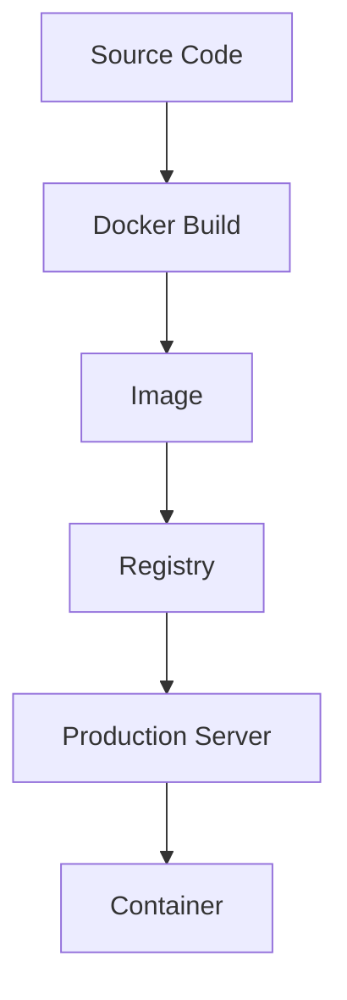

---

# 54 — Build Once, Deploy Same Artifact

Old manual style:

```text
server 1
↓
npm install

server 2
↓
npm install

server 3
↓
npm install
```

Potential drift.

Image model:

```text
CI
↓
build image X
↓
test image X
↓
push image X
↓
production pulls image X
```

Core production Docker philosophy:

> **Build once → distribute artifact → run same artifact.**

---

# 55 — Production Server + Nginx + Docker

Same-host Nginx architecture:

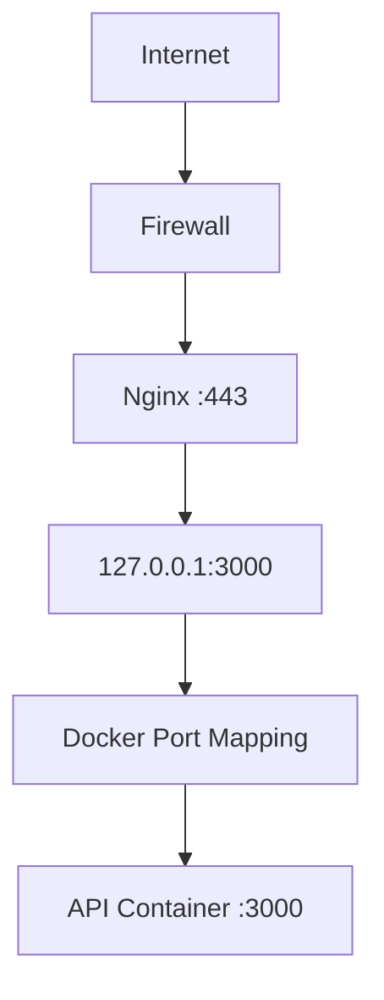

Example:

```bash
docker run -d \
  --name api \
  -p 127.0.0.1:3000:3000 \
  himanshu/my-api:1.0.0
```

Why bind host side to `127.0.0.1`?

```text
Nginx is public entry
↓
API host port local-only
↓
less unnecessary exposure
```

Alternative architectures can containerize Nginx too.

---

# 56 — Production Compose Pattern

Development:

```yaml
backend:
  build: ./backend
```

Production often:

```yaml
backend:
  image: registry.example.com/my-api:1.0.0
```

Why?

```text
CI/build environment
↓
build once
↓
registry
↓
production runs exact image
```

Production server doesn't necessarily need app source/build toolchain.

---

# 57 — Update/Rollback Mental Model

Current:

```text
my-api:1.0.0
```

New:

```text
my-api:1.1.0
```

Deployment:

```text
pull 1.1.0
↓
replace old container
↓
run 1.1.0
```

Rollback:

```text
known good 1.0.0
↓
redeploy
```

This is why explicit versioned artifacts matter.

---

# 58 — Docker Does NOT Solve Everything

Docker helps with:

```text
packaging
isolation
reproducibility
distribution
runtime consistency
```

But not automatically:

```text
bad code
database backups
secret management
monitoring
autoscaling
security policy
cloud networking
high availability
deployment automation
```

Later tools:

```text
CI/CD
Kubernetes
Cloud
Terraform
Observability
```

build around these remaining problems.

---

# 59 — Docker Debugging Flow

Container not working?

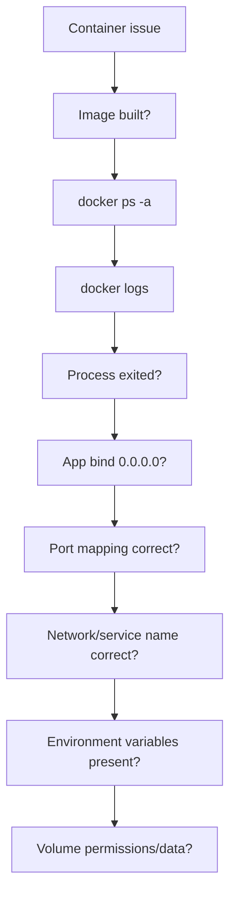

Commands:

```bash
docker ps -a
docker logs CONTAINER
docker inspect CONTAINER
docker exec -it CONTAINER sh
docker network ls
docker volume ls
docker compose ps
docker compose logs -f SERVICE
```

---

# 60 — Full Docker Request Journey

```mermaid
flowchart TB
    A[User Browser] --> B[Domain / DNS]
    B --> C[Production Server]
    C --> D[Nginx :443]
    D --> E[Host 127.0.0.1:3000]
    E --> F[Docker Mapping]
    F --> G[API Container :3000]
    G --> H[Docker Network]
    H --> I[Database Service]
    I --> J[Persistent Volume / Managed DB]
```

---

# 61 — Full Docker Build/Deploy Journey

```mermaid
flowchart TB
    A[Developer] --> B[Git Repository]
    B --> C[CI]
    C --> D[Dockerfile]
    D --> E[Build Image]
    E --> F[Test Image]
    F --> G[Tag / Digest]
    G --> H[Container Registry]
    H --> I[Production Server]
    I --> J[Pull Image]
    J --> K[Run Container]
    K --> L[Nginx]
    L --> M[Users]
```

This is Unit 03 ka master architecture.

---

# 🔑 Unit 03 Keyword Sheet

```text
Container       → isolated running application environment/process context
Image           → packaged template/artifact
Dockerfile      → image build instructions
Docker build    → Dockerfile/context → image
Docker run      → image → container
Registry        → image storage/distribution
Port mapping    → host port → container port
EXPOSE          → documents intended container port; does not publish host port
Volume          → Docker-managed persistent storage
Bind mount      → host path mounted into container
Network         → container communication boundary
localhost       → current network namespace/container itself
Service name    → Docker/Compose DNS name
Compose         → multi-container application configuration
depends_on      → startup dependency/order, not readiness by itself
Healthcheck     → service health test
Layer           → reusable immutable image filesystem content
Build cache     → reuse unchanged build results
.dockerignore   → build-context exclusions
Multi-stage     → build in one stage, copy required output into runtime stage
Non-root        → least-privilege container process
Tag             → human-friendly image reference/version
Digest          → content-addressed immutable image identifier
Push            → local/CI image → registry
Pull            → registry → machine
```

---

# 🧠 Active Recall — Short Answers

**Q1. Docker ki original problem?**  
Application environment/dependency inconsistency and reproducibility.

**Q2. Container kya hai?**  
Isolated running application environment/process context.

**Q3. Container full VM hai?**  
No.

**Q4. VM vs container main difference?**  
VM own guest kernel; Linux containers generally host kernel share karte hain.

**Q5. Namespace role?**  
Isolation/view.

**Q6. cgroups role?**  
Resource accounting/limits.

**Q7. Image?**  
Container create karne ka packaged artifact/template.

**Q8. Container?**  
Image ka running instance.

**Q9. Dockerfile?**  
Image build instructions.

**Q10. `RUN` kab execute hota hai?**  
Build time.

**Q11. `CMD` kab?**  
Container startup/runtime.

**Q12. `EXPOSE 3000` host port publish karta hai?**  
No.

**Q13. `docker build -t my-api .`?**  
Current context se tagged image build.

**Q14. `docker run`?**  
Image se container create/start.

**Q15. `-d`?**  
Detached/background mode.

**Q16. `-p 8080:3000`?**  
Host 8080 → container 3000.

**Q17. App container ke andar often kis address par bind kare?**  
`0.0.0.0` when it must accept traffic through container interfaces.

**Q18. `docker ps`?**  
Running containers.

**Q19. `docker ps -a`?**  
All containers.

**Q20. Volume?**  
Docker-managed persistent storage.

**Q21. Bind mount?**  
Host path → container path.

**Q22. Volume vs bind mount?**  
Docker-managed storage vs host-path mapping.

**Q23. Container delete hone par writable-layer data?**  
Removed with container.

**Q24. Container ka localhost?**  
That container itself.

**Q25. Backend container se Mongo container ka address?**  
Same network par `mongo:27017` style service/container name.

**Q26. Container IP hardcode kyun avoid?**  
Recreation par address change ho sakta hai.

**Q27. Internal Mongo port host par publish required?**  
No.

**Q28. Docker Compose kyun?**  
Multi-container app configuration/manage karne ke liye.

**Q29. `image:` vs `build:`?**  
Existing image use vs own image build.

**Q30. Compose default network?**  
Basic project services ko common network provide kar sakta hai.

**Q31. Browser `backend:3000` kyun fail kar sakta hai?**  
Browser Docker internal DNS/network ka member nahi.

**Q32. `depends_on` = ready?**  
No.

**Q33. Running = healthy?**  
No.

**Q34. `docker compose up -d`?**  
Stack background mein start.

**Q35. `docker compose down -v` danger?**  
Named volumes/data remove kar sakta hai.

**Q36. Build cache?**  
Unchanged build results reuse.

**Q37. Package files `npm ci` se pehle separately copy kyun?**  
Dependency-install layer cache longer retain karne ke liye.

**Q38. `.dockerignore`?**  
Files ko build context se exclude.

**Q39. `.gitignore` same hai?**  
No.

**Q40. Alpine always best?**  
No.

**Q41. Multi-stage build?**  
Builder se required output final runtime stage mein copy.

**Q42. Non-root container kyun?**  
Least privilege.

**Q43. Image tag?**  
Human-friendly version/reference.

**Q44. Digest?**  
Immutable content identifier.

**Q45. Registry?**  
Container images store/distribute karta hai.

**Q46. `docker push`?**  
Image registry mein upload.

**Q47. `docker pull`?**  
Registry se image retrieve.

**Q48. Production server ko source clone karna compulsory?**  
No, image-based deployment can run prebuilt artifact.

**Q49. Docker solves database backups automatically?**  
No.

**Q50. Core production philosophy?**  
Build once → distribute image → run same artifact.

---

# ⚡ 2-Minute Revision

```text
PROBLEM
works on my machine
↓
Docker packages runtime/userspace + app

CORE
Dockerfile → build → Image → run → Container

NETWORK
-p HOST:CONTAINER
inside container localhost = itself
service names for container-to-container DNS

STORAGE
container writable layer = disposable
volume = persistent Docker-managed
bind mount = host path

COMPOSE
compose.yaml
services + ports + volumes + env + networks

PRODUCTION IMAGE
layers
cache
.dockerignore
npm ci
small compatible base
multi-stage
non-root
healthcheck

DISTRIBUTION
tag image
push registry
pull production

DEPLOYMENT
Internet
↓
Nginx :443
↓
localhost host port
↓
Docker mapping
↓
API container
↓
DB/network/volume

PHILOSOPHY
Build once
↓
test artifact
↓
push
↓
run same artifact
```

---

# ✅ Coverage Checklist

- [x] Why Docker exists
- [x] Containers vs VMs
- [x] Docker on Windows
- [x] Namespaces/cgroups Pareto model
- [x] Image vs container
- [x] Dockerfile
- [x] FROM / WORKDIR / COPY / RUN / CMD / EXPOSE
- [x] Build/run
- [x] Docker CLI/daemon mental model
- [x] Registry
- [x] Port mapping
- [x] Container bind addresses
- [x] Container lifecycle commands
- [x] Writable layer
- [x] Volumes
- [x] Bind mounts
- [x] Node modules mount problem
- [x] Docker networks
- [x] localhost in containers
- [x] Container/service DNS
- [x] Host→container vs container→container
- [x] Docker Compose
- [x] services/image/build/ports/volumes/environment
- [x] default network
- [x] depends_on/readiness
- [x] healthchecks
- [x] dev bind mounts
- [x] Dockerfile vs Image vs Container vs Compose
- [x] Layers
- [x] Build cache
- [x] `.dockerignore`
- [x] `npm ci`
- [x] Base image trade-offs
- [x] Multi-stage builds
- [x] Non-root containers
- [x] Tags/digests
- [x] Registry push/pull
- [x] Build once/deploy same artifact
- [x] Production Nginx + Docker
- [x] Production Compose model
- [x] Updates/rollback
- [x] Docker limitations
- [x] Debugging workflow
- [x] Full build/deploy/request lifecycle

---

# 🏁 Unit 03 Complete

```text
🐳 Docker
██████████ 100% ✅

Next:
☁️ AWS / Cloud
```
